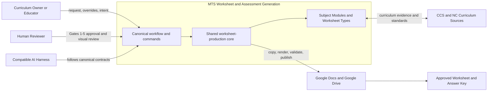
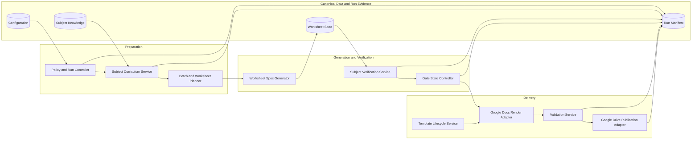
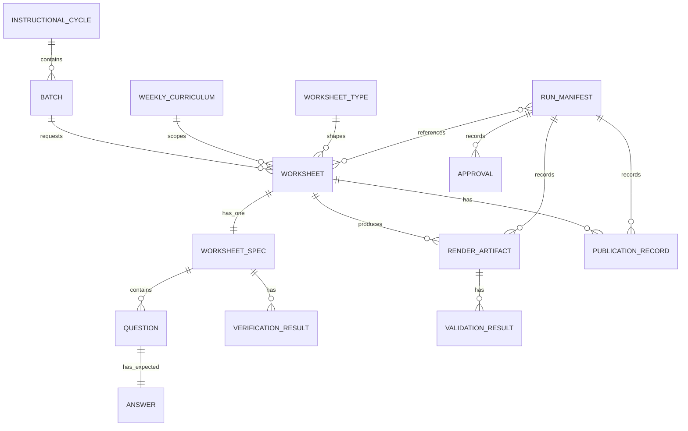

# MTS Math Worksheet Generation - M3 Architecture

Status: Proposed for M3 architecture review

## 1. Authority And Scope

This architecture implements the MTS Math Product Idea and Requirements. It follows the repository-wide [AI-Native SDLC --- Personal](../../docs/knowledge/ai-native-sdlc-personal.md) methodology: preserve human intent, keep consequential artifacts reviewable, use deterministic mechanisms where practical, and retain lifecycle evidence.

The architecture is designed for future subject modules, including ELA, and Worksheet Types, including SAT, SAT Mini, ACT, and ACT Mini. Those extensions are proposed architecture capabilities only; their product scope, requirements, and acceptance criteria must be approved before they are implemented.

This is an M3 architecture decision artifact. M4 will define detailed schemas, APIs, state-machine transitions, and algorithms. M5 will implement bounded components and integration.

## 2. Functional Architecture

The system is organized as a shared worksheet-production core plus subject-owned modules.

### 2.1 C1 System Context



The system boundary is the governed worksheet-production workflow. Curriculum sources and Google Docs/Drive are external systems; AI harnesses invoke the canonical workflow but do not own requirements, state transitions, or approval policy. Subject and assessment modules supply their own curriculum, generation, verification, and layout rules through shared contracts.

### 2.2 C2 Container View



Container responsibilities:

| Container | Components | Responsibility |
|---|---|---|
| Preparation | Policy and Run Controller, Subject Curriculum Service, Batch and Worksheet Planner | Resolve approved run context, subject scope, and expected Worksheet set. |
| Generation and Verification | Worksheet Spec Generator, Subject Verification Service, Gate State Controller | Generate canonical content, establish subject-specific correctness, and enforce approval transitions. |
| Delivery | Template Lifecycle Service, Google Docs Render Adapter, Validation Service, Google Drive Publication Adapter | Render copied templates, prove artifact quality, and publish approved pairs. |
| Canonical Data and Run Evidence | Subject Knowledge, Configuration, Worksheet Spec, Run Manifest | Provides durable facts and variable policy, owns canonical content, and retains lifecycle evidence. |

| Component | Functional Areas | Responsibility |
|---|---|---|
| Project Policy Resolver | SP | Resolves configuration defaults and current-run overrides into an immutable policy snapshot. |
| Curriculum Service | SYC, PIC, RWC | Reads yearly curriculum and local evidence, resolves weekly scope, records source confidence and freshness. |
| Batch Coordinator | PB, PW | Builds the expected Worksheet set and a per-Worksheet preparation plan. |
| Worksheet Spec Generator | GW | Uses approved scope and policy to create one canonical structured Worksheet Spec. |
| Math Verification Service | VW | Performs deterministic recomputation where supported and records required reasoning-review outcomes. |
| Gate State Controller | MW | Enforces persisted approval transitions and dependency invalidation. |
| Template Lifecycle Service | MT | Resolves registered masters, revision state, cache validity, and controlled template promotion. |
| Render Adapter | FW | Copies approved templates and renders student/key documents from the same verified Worksheet Spec. |
| Validation Service | VAL | Performs content QA and records visual/layout QA evidence. |
| Publication Adapter | PUB | Publishes only approved paired artifacts and confirms destination/naming. |
| Run Repository And Telemetry | MW | Persists run state, artifacts, approvals, invalidations, retries, and authoritative metrics. |

### Subject And Assessment Extension Contract

The shared core must depend on a subject module and a Worksheet Type selected by configuration, not on Math-specific rules.

| Extension Point | Subject Module Owns | Worksheet Type Owns | Shared Core Owns |
|---|---|---|---|
| Curriculum | Standards, progression, sources, confidence interpretation, and subject knowledge | Tested domains and blueprint constraints | Run linkage, source provenance, gate eligibility, and cache lifecycle |
| Content generation | Subject prompts, question forms, answer rules, and reasoning guidance | SAT/ACT full or mini section structure, time limits, counts, and scoring policy | Spec lifecycle, revision, and student/key synchronization |
| Verification | Deterministic checkers and reasoning-review rules | Type-specific scoring, timing, and completeness checks | Verification state, failure blocking, and Gate 3 enforcement |
| Rendering and QA | Subject notation, passages, diagrams, and answer-space needs | Section labels, instructions, layout, and template selection | Template copy, artifact pairing, QA recording, gates, and publishing |

New subjects and Worksheet Types must be additive: they may register configuration, knowledge, templates, verification rules, and tests, but must not require changes to shared gate, publication-pair, audit, or run-evidence semantics unless a new approved requirement requires it.

## 3. Informational Architecture

### Canonical records

- **Configuration snapshot:** immutable resolved defaults and run overrides for one Run.
- **Yearly Curriculum:** reusable standards, progression, prerequisites, source provenance, and freshness metadata.
- **Weekly Curriculum:** grade/course-specific resolved scope for an Instructional Cycle, including confidence and evidence.
- **Batch:** expected Worksheet set and shared request context.
- **Worksheet Type:** configuration-selected definition of a worksheet mode, such as Weekly Worksheet, SAT, SAT Mini, ACT, or ACT Mini, including section, time, count, scoring, and template rules.
- **Worksheet Spec:** the only structured source for student questions and answer-key entries.
- **Verification Result:** per-question deterministic and reasoning evidence, plus aggregate readiness.
- **Approval:** explicit human decision tied to a gate and artifact revision.
- **Render Artifact:** staging document link, template revision, and QA evidence.
- **Run Manifest:** durable lifecycle record joining all records above for one execution attempt.

### Ownership and derivation

```text
Project policy + subject knowledge + cycle request + Worksheet Type
  -> resolved scope -> batch -> Worksheet Spec
  -> verification -> render artifacts -> validation -> approved publication pair

Run Manifest references revisions and evidence; it is not a second source
of questions, answers, curriculum scope, Worksheet Type, or policy.
```



The existing shared Worksheet Spec and Run Manifest schemas are intentionally cross-subject. M4 will add subject and Worksheet Type fields, then define subject extensions without allowing student/key content to split into separate canonical sources.

## 4. Non-Functional Architecture

| Quality Attribute | Architectural Strategy |
|---|---|
| Correctness | Deterministic subject verification is code; non-deterministic items require explicit reasoning-review evidence. |
| Synchronization | Both rendered outputs consume the same verified Worksheet Spec revision. |
| Human approval integrity | Gate State Controller persists and validates each enabled transition. |
| Curriculum integrity | Curriculum Service retains source, freshness, confidence, and cache/fallback basis. |
| Template fidelity | Render Adapter copies masters only; Template Lifecycle Service tracks revisions. |
| Recoverability | Run Repository records checkpoints and dependency invalidation to resume only valid work. |
| Reviewability | Summary, structured artifacts, and evidence-on-demand are retained for consequential decisions. |
| Portability | Model/harness adapters invoke canonical workflows and contracts rather than duplicating policy. |
| Observability | Run manifests record timing, tool calls, cache state, retries, approvals, verification, and outputs. |

The executable fitness functions are defined in `fitness-functions.md`.

## 5. Technology Architecture

The proposed initial stack is deliberately small:

| Need | Technology | Rationale |
|---|---|---|
| Deterministic services and adapters | Python standard library plus narrowly scoped Google API dependencies | Existing Math runtime is Python and deterministic subject logic is straightforward to test. |
| Human-editable policy | YAML | Existing configuration uses YAML and requirements demand changeable defaults. |
| Interchange and validation contracts | JSON and JSON Schema | Existing Worksheet Spec and Run Manifest contracts are JSON-based. |
| Knowledge and design artifacts | Markdown and structured curriculum files | Supports reviewability, provenance, and version control. |
| Render/publish platform | Google Docs and Google Drive | Required current document and publication platform. |
| Automated checks | pytest-compatible Python tests | Supports deterministic unit and integration tests with low technology diversity. |
| Persisted run state | Versioned JSON files under `runs/` | Meets initial resumability/audit needs without introducing a database prematurely. |

A database, web application, queue, or additional orchestration framework is out of scope unless a documented requirement cannot be met by this stack.

## 6. Responsibility Architecture

- **Human:** owns intent, curriculum/Question/verification/format/publish approvals, exception decisions, and explicit template promotion.
- **AI:** interprets subject evidence, generates questions, and conducts non-deterministic reasoning/ambiguity review under the governed workflow.
- **Software:** validates schemas and state transitions, performs deterministic checks, manages invalidation, invokes external adapters, and verifies publication outcomes.
- **Knowledge:** holds standards, curriculum progression/cache, source metadata, templates, and approved examples.
- **Configuration:** owns variable Worksheet Type behavior, question counts, enabled gates, template registrations, destinations, and thresholds.
- **Workflow and skills:** sequence work and define AI reasoning inputs/outputs; they cannot grant approval or bypass validation.

## 7. Proposed Architecture Decisions

1. **Shared core plus subject modules:** subject modules own subject semantics; shared components own cross-subject lifecycle mechanics.
2. **Canonical Worksheet Spec:** it is the single source for all question/answer content; outputs are projections, never independent content stores.
3. **File-based run manifests first:** use versioned structured files until demonstrated multi-user, concurrent, query, or transaction needs require a data store.
4. **Adapter boundary for Google:** all Google Docs/Drive interactions are isolated behind render/publication interfaces.
5. **Testable quality attributes:** critical NFRs require executable fitness functions whenever practical; manual visual QA remains explicit where automation cannot replace it.
6. **Additive extension model:** ELA and new Worksheet Types such as SAT, SAT Mini, ACT, and ACT Mini plug into the shared core through configuration and subject/type contracts; they do not fork the lifecycle.

These decisions should become ADRs after M3 approval only if they remain architecturally significant and stable.

## 8. M4 Inputs

M4 design must define:

- Expanded Worksheet Spec, Run Manifest, approval, verification, template, and artifact schemas.
- Gate state machine, legal transitions, checkpoints, and invalidation rules.
- Shared core interfaces plus subject-module and Worksheet Type contracts.
- Google Docs/Drive Render and Publication adapter interfaces and failure/retry semantics.
- Detailed test fixtures, mocks, and acceptance/fitness-function harnesses.

## 9. Responsibility Matrix

This matrix applies the Human / AI / Software actor model and the Knowledge / Config / Command / Workflow / Skill / Code placement model. It prevents deterministic policy from drifting into prompts.

| Functional Area | Human | AI | Software | Primary Placement |
|---|---|---|---|---|
| SP - Setup Project | Approves policy and persistent changes | Explains options | Resolves snapshots and validates configuration | Config, Code |
| SYC - Setup Yearly Curriculum | Approves source/progression changes | Interprets source gaps | Validates records and dependency invalidation | Knowledge, Code |
| PIC - Prepare Instructional Cycle | Chooses cycle intent and exceptions | Interprets special request context | Calculates dates and records calendar context | Workflow, Config, Code |
| RWC - Resolve Weekly Curriculum | Approves Gate 1 scope | Synthesizes evidence when needed | Reads caches, applies source/freshness fallback rules, records provenance | Knowledge, Config, Code, Skill |
| PB - Prepare Batch | Selects grades/types/destination overrides | Clarifies batch intent | Creates expected set and detects incomplete Batch state | Workflow, Code |
| PW - Prepare Worksheet | Approves meaningful exceptions | Recommends instructional structure | Resolves counts, type, content mix, and profile | Config, Code, Skill |
| GW - Generate Worksheet | Reviews at Gate 2 | Generates questions and expected answers | Creates/validates canonical Worksheet Spec structure | Skill, Code |
| VW - Verify Worksheet | Approves Gate 3 and resolves exceptions | Reviews ambiguity and non-deterministic reasoning | Recomputes supported items and blocks failures | Code, Skill |
| FW - Format Worksheet | Reviews Gate 4 artifacts | Produces approved narrative/text when needed | Copies templates and renders documents | Code, Config |
| VAL - Validate Worksheet | Judges visual/layout QA | Identifies qualitative presentation defects | Performs targeted content/consistency checks | Code, Skill |
| PUB - Publish Worksheet | Grants Gate 5 approval | None | Publishes paired artifacts and confirms destination/naming | Code, Config |
| MT - Manage Templates | Approves template promotion | Assists inspection interpretation | Compares revisions and maintains cache state | Knowledge, Config, Code |
| MW - Manage Workflow | Grants required approvals | Follows canonical workflow instructions | Enforces state transitions, resume, invalidation, and telemetry | Workflow, Code |

### Placement Rules

1. A prompt, command, or skill cannot authorize a gate transition, publication, or exception without a persisted Human approval.
2. A repeated calculation, schema rule, naming rule, state transition, or artifact-pairing check belongs in Code.
3. A changeable count, threshold, template registration, destination, or feature flag belongs in Config.
4. Curriculum facts, source metadata, examples, and template structure belong in Knowledge.
5. Work sequencing and state eligibility belong in Workflow; AI reasoning inputs, outputs, and review instructions belong in Skills.
6. Commands are thin invocation surfaces and must not duplicate requirements, policy, or implementation rules.

## 10. Fitness Functions

Fitness functions translate critical non-functional requirements into repeatable evidence. Manual evidence is retained only where visual or human judgment cannot be safely automated.

| ID | Quality Attribute | NFR Coverage | Architecture Strategy | Fitness Function | Evidence | Execution |
|---|---|---|---|---|---|---|
| FF-01 | Correctness and verification completeness | NFR-001, NFR-002 | Deterministic Math checks are implemented in code; non-deterministic items require recorded reasoning review. | Every Question has a passing deterministic result or explicit completed reasoning review; any failure or ambiguity blocks rendering. | Per-question Verification Result and test report. | Automated plus Human/AI review |
| FF-02 | Worksheet/key consistency | NFR-003 | Student and key rendering both consume one verified Worksheet Spec revision. | Reject a render request unless student content and key entries reference the same validated Worksheet Spec revision. | Schema/integration test and render manifest. | Automated |
| FF-03 | Curriculum integrity and cache freshness | NFR-004, NFR-016 | Curriculum resolution retains source, confidence, freshness, and cache/fallback basis. | Each Weekly Curriculum record has source, confidence, and cache/fallback basis; inferred content is never labeled confirmed. | Curriculum schema tests and resolution fixtures. | Automated |
| FF-04 | Reviewability and visualized traceability | NFR-005, NFR-021 | Consequential artifacts have concise structured sources, traceability, and visual summaries where relationships need visualization. | Reject a significant artifact that lacks declared authority, purpose, Functional Area coverage, or required traceability links. | Documentation check and recorded architecture/release review. | Automated plus Manual review |
| FF-05 | Print quality | NFR-006 | Content QA detects logical artifact defects; explicit visual/layout QA covers pagination, whitespace, wrapping, answer space, and readability. | Reject artifacts with missing/duplicate/truncated questions, unresolved placeholders, or material blank pages/large gaps; record visual QA before final approval. | Targeted QA report and visual/layout review record. | Automated plus Manual visual QA |
| FF-06 | Editability | NFR-007 | The Google Docs render adapter copies editable masters and records resulting document artifacts. | Reject a required editable output if it cannot be opened and edited as a Google Doc. | Adapter integration test and artifact inspection. | Automated plus Manual review |
| FF-07 | Template fidelity and master protection | NFR-008, NFR-014 | Template Lifecycle Service tracks revisions; Render Adapter copies masters and limits invalidation to affected templates. | Rendering never updates a master template; a changed template revision invalidates only affected render/cache state. | Adapter mock tests, template manifest, and Run Manifest. | Automated |
| FF-08 | Performance and fallback safety | NFR-009, NFR-010 | Cache-first curriculum resolution and template revision guards avoid repeated external research or full inspection while triggering fallback when confidence/freshness is insufficient. | A valid cache/revision avoids expensive refresh; cache miss, stale/changed source, insufficient confidence, contradiction, or explicit freshness request triggers the configured fallback. | Cache behavior tests and Run telemetry. | Automated |
| FF-09 | Resumability | NFR-011 | Run Manifests persist valid checkpoints, approvals, artifacts, and dependency invalidation state. | Resume only from the latest valid checkpoint and never reuse state invalidated by a changed Question, scope, or template revision. | Run-manifest fixtures and resume/invalidation tests. | Automated |
| FF-10 | Maintainability | NFR-012 | Canonical requirements/design/skills define stable policy; commands and adapters remain thin. | Reject an adapter or command that duplicates governing policy instead of referencing its canonical source. | Adapter review checklist and documentation lint. | Automated plus Manual review |
| FF-11 | Portability | NFR-013 | Shared contracts and thin adapters isolate harness-specific invocation from canonical workflow behavior. | Equivalent canonical inputs produce equivalent validation decisions across supported harness adapters. | Cross-harness fixture test and adapter contract review. | Automated plus Manual review |
| FF-12 | Observability | NFR-015 | Run Manifests record timing, tool calls, cache state, retries, approvals, verification, and artifact outcomes. | A completed or failed Run contains all required diagnostic fields; token usage is null when authoritative data is unavailable. | Run-manifest schema and integration test. | Automated |
| FF-13 | Batch scalability | NFR-017 | Batch Coordinator isolates per-Worksheet curriculum scope, verification, artifacts, and invalidation. | Regenerating or correcting one Worksheet does not modify, invalidate, or publish unrelated Worksheets in the same Batch. | Batch-isolation integration test. | Automated |
| FF-14 | Deterministic naming and publication-pair integrity | NFR-018 | Publication Adapter validates Gate 5, configured names, destinations, and paired artifacts before publication. | Reject publication unless Gate 5 approval exists and both correctly named artifacts are present at the intended destination. | Publication integration test and publish record. | Automated |
| FF-15 | Backward compatibility and behavior preservation | NFR-019, NFR-020 | Regression fixtures preserve supported Worksheet Types and established Math generation behavior during migration. | Every supported Worksheet Type has a regression fixture; a migration fails when a protected behavior changes without approved requirement/design evidence. | Regression suite and change review record. | Automated plus Manual review |
| FF-16 | Responsibility placement | NFR-022, NFR-023 | The responsibility matrix separates Human approval, AI reasoning, and deterministic Software work across Knowledge, Config, Command, Workflow, Skill, and Code. | Reject a design that assigns repeatable deterministic logic, authorization, or approval solely to a prompt, skill, or AI response. | Architecture review checklist and implementation review. | Manual review |
| FF-17 | Executable quality evidence | NFR-024 | Critical NFRs have automated fitness functions whenever practical; manual evidence is explicit where automation cannot safely replace human review. | Each critical quality attribute has a named strategy, fitness function, retained evidence, and declared execution mode. | This section, test results, manifests, and QA records. | Automated plus Manual review |

### Minimum M4 Test Plan

1. Unit tests for all deterministic Math verifier methods, Worksheet Spec validation, policy resolution, and gate transitions.
2. Fixture-driven tests for curriculum cache hits, fallback conditions, confidence labels, and Grade 9/10 split handling.
3. Mocked integration tests for template-copy rendering and paired Google Drive publication behavior.
4. Run-manifest tests for resume and invalidation after Question, curriculum, and template changes.
5. Rendered text/content tests plus mandatory recorded visual/layout QA for final documents.
6. Regression fixtures imported from the functional mts-new Math workflow before its production behavior is replaced.

### Evidence Rule

A passing command is not itself proof of a passing fitness function. The associated test output, manifest record, QA result, or explicit review decision must be retained with the affected Run or release evidence.
