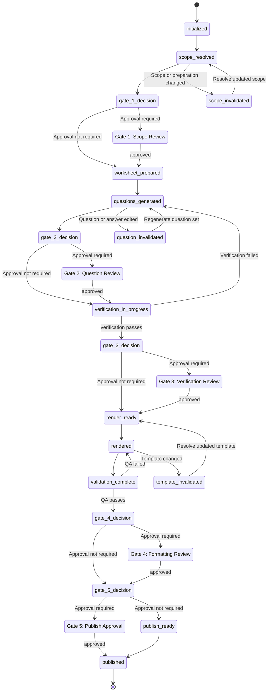
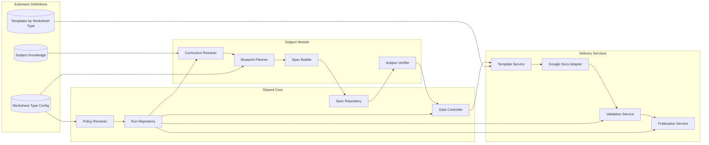
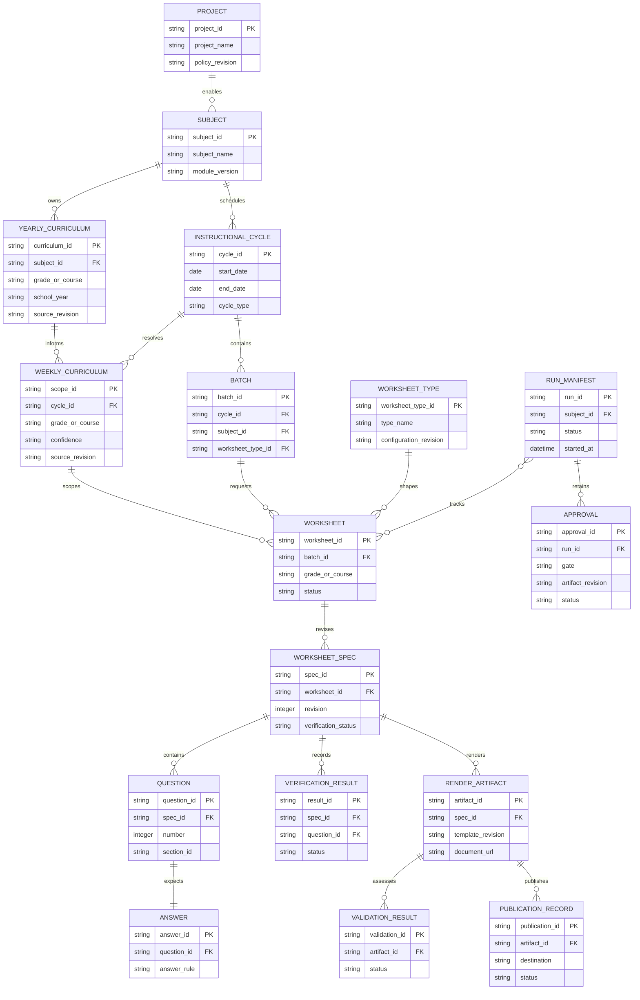
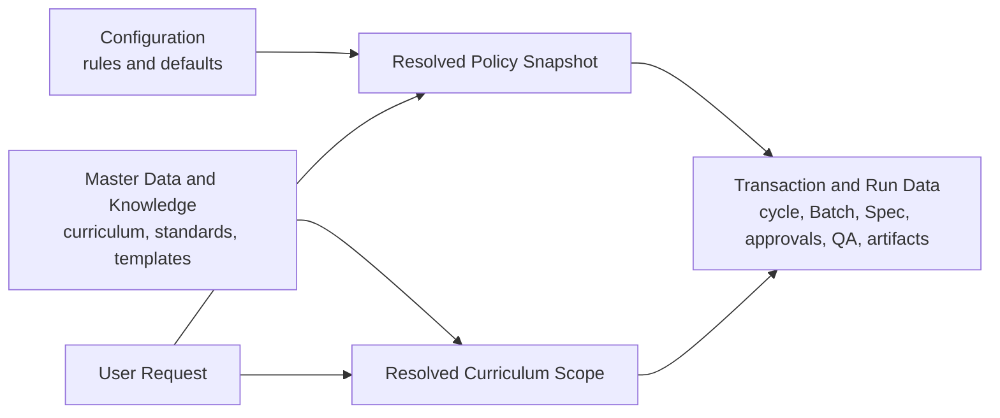

# MTS Worksheet and Assessment Generation - M4 Detailed System Design

Status: Proposed for M4 design review

## 1. Purpose And Authority

This document turns the approved M3 Architecture into implementable contracts. It is derived from the M1 Product Idea, M2 Requirements, and M3 Architecture. It defines detailed state, data, module, adapter, extension, and test contracts; it does not authorize implementation until M4 review is complete.

Math is the first implementation baseline. ELA and the SAT, SAT Mini, ACT, and ACT Mini Worksheet Types use the same contracts but cannot be enabled until their extension packages meet `FR-SP-014`.

## 2. Detailed Lifecycle State Machine

A Run is a durable execution record. Each Worksheet or assessment artifact in the Run progresses independently after its Batch is prepared.



  Invalidation states make the recovery boundary explicit. A Question edit invalidates verification and downstream artifacts; a scope change invalidates Questions and downstream artifacts; and a template change invalidates rendering, validation, and publication state. Section 2.2 remains the authoritative invalidation contract.

### 2.1 Gate Contract

| Gate | Required input revision | Persisted approval fields | Allows transition to |
|---|---|---|---|
| Gate 1: Scope Review | Weekly/assessment scope | `gate`, `status`, `artifact_revision`, `approved_at`, `reviewer`, `notes` | `worksheet_prepared` |
| Gate 2: Question Review | Complete editable question set | Same fields | `verification_in_progress` |
| Gate 3: Verification Review | Verification summary and item results | Same fields | `render_ready` |
| Gate 4: Formatting Review | Rendered student/key artifacts and QA result | Same fields | `publish_approval_pending` |
| Gate 5: Publish Approval | Final validation and intended publication pair | Same fields | `published` |

A rejection, expired approval, or changed source revision blocks the associated transition. An approval never applies to a later revision.

### 2.2 Invalidation Contract

| Changed input | Invalidates | Preserves |
|---|---|---|
| User override or resolved policy | Affected scope, Worksheet preparation, questions, and downstream evidence | Unaffected Worksheets and independent Batch members |
| Curriculum scope | Affected Worksheet questions, verification, render, validation, and publication | Batch membership and unaffected grade/course scopes |
| Question or answer | That Question verification and affected Worksheet verification/render/validation/publication | Curriculum approval and unrelated Worksheets |
| Template revision | Affected template cache, rendered artifacts, validation, and publication | Approved scope, questions, and verification |
| Destination/naming configuration | Publication readiness and publication record | Scope, questions, verification, rendering, and validation |

## 3. Module And Interface Design

### 3.1 C3 Component Design



The C3 components are independently testable. Subject modules invoke shared core interfaces; delivery services never make curriculum or gate-policy decisions.

### 3.2 C4 Implementation Mapping

| C3 component | M5 module/file target | Main implementation responsibility |
|---|---|---|
| Policy Resolver | `src/runtime/policy.py` | Merge base, subject, Worksheet Type, and run-override configuration into an immutable snapshot. |
| Run Repository | `src/runtime/run_repository.py` | Create, validate, checkpoint, resume, and persist Run Manifests. |
| Gate Controller | `src/runtime/gates.py` | Enforce revision-scoped Gate 1-5 approvals and legal state transitions. |
| Spec Repository | `src/runtime/spec_repository.py` | Validate and persist immutable Worksheet Spec revisions. |
| Curriculum Resolver | `subjects/<subject>/src/curriculum.py` | Resolve subject scope from knowledge, cache, and source-fallback policy. |
| Blueprint Planner | `subjects/<subject>/src/blueprint.py` | Apply Worksheet Type rules to the approved subject scope. |
| Spec Builder | `subjects/<subject>/src/generation.py` | Build the ordered Worksheet Spec from the approved blueprint. |
| Subject Verifier | `subjects/<subject>/src/verification.py` | Provide deterministic checks and required reasoning-review results. |
| Template Service | `src/rendering/template_service.py` | Resolve the registered template pair and validate revision/cache state. |
| Google Docs Adapter | `src/rendering/google_docs_adapter.py` | Copy masters, render projections, and inspect resulting documents. |
| Validation Service | `src/verification/validation_service.py` | Run shared content QA and combine subject/type-specific validation. |
| Publication Service | `src/verification/publication_service.py` | Publish approved artifact pairs and verify naming/destination. |

No M5 file may combine subject semantics, shared gate control, and Google API I/O. That separation is the C4 enforcement of the M3 boundaries.

### 3.3 Shared Core Interfaces

| Interface | Input | Output | Failure behavior |
|---|---|---|---|
| `PolicyResolver.resolve` | Request, base config, subject config, Worksheet Type config, run overrides | Immutable policy snapshot | Reject unknown/invalid override. |
| `RunRepository.create_or_resume` | Request identity and policy snapshot | Run Manifest checkpoint | Reject incompatible resume revision. |
| `GateController.require_approval` | Gate, artifact revision, manifest | Approval or blocked state | Fail closed when approval is absent/rejected/stale. |
| `SpecRepository.write_revision` | Validated Spec and parent revision | Immutable Spec reference | Reject schema/lineage failure. |
| `TemplateService.resolve` | Subject, Worksheet Type, grade/course, template selection | Template pair and revision metadata | Reject unregistered or stale-uninspected template. |
| `Renderer.render_pair` | Verified Spec reference, template pair, destination | Two staging Render Artifacts | Reject non-passing verification or master-write request. |
| `Validator.validate_pair` | Render artifacts and Spec reference | Content and visual QA record | Block final approval on any required QA failure. |
| `Publisher.publish_pair` | Gate 5 approval, validated pair, destination | Publication Record | Reject missing, mismatched, or incorrectly named pair. |

### 3.4 Subject Module Interface

Every subject module implements:

```text
resolve_curriculum(request, knowledge, policy) -> ResolvedScope
prepare_blueprint(scope, worksheet_type, policy) -> WorksheetPlan
build_spec(plan, approved_inputs) -> WorksheetSpec
verify_spec(spec, policy) -> VerificationResult
review_guidance(spec, policy) -> HumanOrAIReviewInstructions
render_requirements(spec, worksheet_type) -> SubjectRenderRequirements
validate_subject_output(artifacts, spec) -> SubjectValidationResult
```

Math uses deterministic calculation when possible and reasoning review otherwise. ELA adds passage-support, inference-evidence, distractor, grammar, and open-response checks. Future subjects must expose equivalent behavior, not bypass shared contracts.

### 3.5 Worksheet Type Interface

Every Worksheet Type declares:

```text
worksheet_type_id
compatible_subjects
sections and ordering
question-count and duration rules
scoring and answer-key rules
template selection rules
type-specific validation rules
type regression fixtures
```

SAT/ACT Worksheet Types define their approved scope only after their respective M1/M2 artifacts are added. “Mini” types must be separate type IDs, not informal count overrides, so their time, sections, scoring, and templates remain testable.

### 3.6 Google Docs/Drive Adapter Contract

The adapter separates external I/O from workflow policy:

1. `copy_master(template_id, destination, name)` must create a new document; it may never update a master.
2. `render_document(copy_id, projection)` consumes a projection generated from the verified Spec revision.
3. `inspect_document(copy_id)` returns text/structural evidence needed for automated QA.
4. `publish_pair(student_artifact, key_artifact, destination)` confirms both files, names, parent folders, and links before recording success.
5. Retryable external failures are recorded in the Run Manifest. Nonretryable failures return a blocked state and preserve upstream approvals.

## 4. Detailed Entity Relationship Design

This ERD is the detailed implementation model. It shows ownership and reference relationships without treating the Run Manifest as a second source of Worksheet content.



## 5. Data Classification, Ownership, And Contracts

The root `schemas/` directory owns shared contracts. `subjects/<subject>/schemas/` may add subject-specific definitions and must compose with, not replace, shared contracts. Existing P0 schemas remain compatibility inputs until M5 migration replaces them with versioned contracts.

### 5.1 Data Classification And Ownership

| Data class | Answers | Created/changed by | Reuse rule | Primary locations |
|---|---|---|---|---|
| Configuration | How should the system behave? | Approved configuration change or current-run override | Reusable defaults; a run override is never persisted unless explicitly approved. | `config/`, `subjects/<subject>/config/` |
| Master data and knowledge | What stable, approved facts does the system know? | Curriculum/template/source management | Reusable across Runs; changes are versioned with source provenance. | `subjects/<subject>/knowledge/`, `templates/by-worksheet-type/` |
| Transaction and run data | What happened for this request, cycle, Batch, Worksheet, and Run? | A specific worksheet-generation Run | Never reused as a default; changed records create a new revision or Run evidence record. | `runs/<subject>/<run_id>/` |

Configuration contains variable behavior: enabled subjects/grades, Worksheet Type rules, gates, counts, duration, naming, destinations, and cache thresholds. It must not contain historical curriculum evidence, question content, gate approvals, or Run results.

Master data and knowledge contains versioned reusable facts: subject/grade catalog entries, standards, yearly progression, curriculum sources, approved template metadata, template revisions, layout contracts, and approved fallback relationships. A template manifest is master data because it describes an approved, versioned external asset; a Worksheet Type configuration selects a template but does not redefine the template's inspected structure.

Transaction and run data contains event-specific records: request, effective policy snapshot, Instructional Cycle, resolved Weekly Curriculum, Batch, Worksheet Spec revision, verification results, approvals, render artifacts, QA results, publication record, and telemetry. It must reference configuration and master-data revisions rather than copy them as new sources of truth.



### 5.2 Data Creation Sequence

Before shared runtime implementation, M5 Data Foundation may create and validate baseline Configuration and Master Data files. It must not create real Transaction/Run Data without a request; only schema fixtures and examples may exist before an actual run.

1. Create configuration files and schemas for shared defaults, subjects, and Worksheet Types.
2. Create master-data registries and schemas for subject/grade catalogs, source metadata, template manifests, and curriculum knowledge.
3. Map existing Math curriculum knowledge and template manifest files into the master-data model without losing provenance.
4. Create transaction-data schemas and non-production test fixtures for Runs, Specs, approvals, artifacts, QA, and publication records.
5. Validate all baseline files and preserve the existing Math P0 data paths until the M5 migration gate passes.

### 5.3 Configuration File Contracts

```text
config/
  base.yaml                              # Shared defaults and lifecycle settings
  math.yaml                              # Math enablement and subject defaults
  ela.yaml                               # ELA enablement and subject defaults
  worksheet-types/
    <worksheet-type>.yaml                # Counts, sections, duration, scoring, template selection, validation
```

A Worksheet Type file is configuration because its behavior is intentionally changeable. It can select an approved template by stable key or ID, but the template's revision and inspected layout remain Master Data.

### 5.4 Master Data And Knowledge Contracts

```text
subjects/
  <subject>/
    knowledge/
      grade-course-catalog.json          # Supported grades/courses
      yearly-curriculum.json             # Progression, prerequisites, approximate sequence
      standards.json                     # Authoritative standards cache
      curriculum-sources.json            # Source authority, freshness, provenance
templates/
  by-worksheet-type/
    template-manifest.json               # Approved template IDs, revisions, layout contracts, fallbacks
```

Master Data changes require a version/revision update and invalidate only dependent Transaction/Run Data under the Section 2.2 invalidation contract.

### 5.5 Transaction And Run Data Contracts

```text
runs/
  <subject>/<run_id>/
    run-manifest.json                    # Run state and cross-record references
    resolved-policy.json                 # Immutable effective configuration snapshot
    curriculum/<scope_id>.json           # Resolved scope and provenance
    batches/<batch_id>.json              # Expected Worksheet set
    specs/<spec_id>-r<revision>.json     # Immutable Worksheet Spec revision
    verification/<spec_id>-r<revision>.json
    approvals/<gate>-<revision>.json
    qa/<artifact_id>.json
    artifacts/<artifact_id>.json
    publication/<publication_id>.json
```

Transaction records are append-only evidence wherever possible. A correction creates a revision record and preserves the previous record for auditability; it does not overwrite a prior approved Worksheet Spec, approval, verification result, or publication record.

### 5.6 Shared Worksheet Spec

`schemas/worksheet-spec.schema.json` will become the cross-subject `WorksheetSpec` schema.

| Field group | Required fields | Purpose |
|---|---|---|
| Identity | `spec_version`, `spec_id`, `subject`, `worksheet_type`, `worksheet_id`, `revision` | Identifies one immutable logical content revision. |
| Scope | `instructional_cycle`, `grade_or_course`, `weekly_curriculum`, `source_provenance`, `confidence` | Records approved instructional or assessment scope. |
| Blueprint | `worksheet_type`, `sections`, `question_count`, `duration_minutes`, `scoring_policy`, `template_profile` | Defines profile-driven structure and delivery expectations. |
| Content | `questions[]` with `id`, `number`, `section_id`, `prompt`, `answer`, `skill`, `difficulty`, `standards`, `answer_rule` | Is the only content source for student and key projections. |
| Verification | `verification_status`, `question_results[]`, `reasoning_review_status` | Records readiness and per-question proof. |
| Lineage | `created_at`, `created_by`, `parent_revision`, `input_revisions` | Supports audit and dependency invalidation. |

A `Question` is immutable within a Spec revision. Editing creates a new WorksheetSpec revision with a `parent_revision` reference.

### 5.7 Run Manifest

`schemas/run-manifest.schema.json` will define the single Run record under `runs/<subject>/<run_id>/run-manifest.json`.

| Field group | Required fields | Purpose |
|---|---|---|
| Identity | `manifest_version`, `run_id`, `subject`, `worksheet_type`, `status`, `started_at` | Identifies and classifies the execution. |
| Request and policy | `request`, `resolved_policy`, `policy_revision`, `overrides` | Records user intent and nonpersistent effective configuration. |
| Scope and Batch | `instructional_cycle`, `weekly_curricula[]`, `batch`, `worksheets[]` | Links independent Worksheet/assessment members. |
| State and approvals | `stages`, `checkpoints`, `approvals[]`, `invalidations[]` | Enables legal resume and revision-scoped gates. |
| Evidence | `verification`, `qa`, `artifacts[]`, `publication` | Retains evidence without duplicating Spec content. |
| Telemetry | `timing`, `tool_calls`, `cache`, `retries`, `token_usage` | Supports FF-08 and FF-12; token usage is `null` when not authoritative. |

The manifest stores a Spec ID and revision, not copies of questions or answers.

### 5.8 Extension Registration Contracts

Each enabled extension registers two independent definitions:

| Contract | Location | Required declaration |
|---|---|---|
| Subject module | `subjects/<subject>/` | Subject ID, supported grades/courses, knowledge sources, generation guidance, verifier, render/QA additions, tests. |
| Worksheet Type | `config/worksheet-types/<type>.yaml` | Type ID, compatible subjects, sections, counts, duration, scoring, template selection, validation rules, tests. |

A Worksheet Type can be compatible with multiple subjects. A Worksheet Type does not define curriculum facts or subject reasoning rules. A subject module does not override shared gate, evidence, or publication behavior.

## 6. Responsibility And Technology Design

### 6.1 Detailed Responsibility Allocation

| Responsibility | Actor | Enforced by | M5 evidence |
|---|---|---|---|
| Approve scope, questions, verification, formatting, and publication | Human | Gate Controller records a revision-scoped Approval | Run Manifest approval record |
| Interpret incomplete curriculum evidence and generate/review non-deterministic content | AI | Subject skill/workflow input-output contract | Spec lineage and reasoning-review record |
| Compute answers, validate schemas, enforce state, naming, and pair integrity | Software | Shared core and subject verifier code | Unit/integration test and Run Manifest result |
| Maintain standards, curriculum sources, templates, and examples | Knowledge owner | Versioned knowledge/template records | Source/template revision reference |
| Set counts, duration, gates, destinations, and Worksheet Type rules | Configuration owner | YAML schema and Policy Resolver | Resolved policy snapshot |

### 6.2 Detailed Technology Boundaries

| Concern | Technology boundary | Rule |
|---|---|---|
| Deterministic domain and lifecycle logic | Python | Must be independently unit-testable and have no direct Google API dependency. |
| Changeable policy | YAML plus schema validation | Must be resolved once into the Run policy snapshot; code must not embed per-type counts or IDs. |
| Interchange/persistence contracts | JSON and JSON Schema | Worksheet Specs and Run Manifests are versioned, validated records. |
| External documents | Google Docs/Drive adapter | Only adapter modules import Google client libraries. |
| Secrets | Environment or local untracked secret references | Credentials are never persisted in Specs, Run Manifests, or generated artifacts. |
| Test automation | pytest-compatible Python tests and mocked Google APIs | Live external calls are excluded from deterministic CI tests. |

## 7. File And Ownership Design

```text
config/
  base.yaml
  math.yaml
  ela.yaml
  worksheet-types/
    weekly-worksheet.yaml
    class-worksheet.yaml
    sat.yaml
    sat-mini.yaml
    act.yaml
    act-mini.yaml
schemas/
  worksheet-spec.schema.json
  run-manifest.schema.json
  definitions/
    approval.schema.json
    verification-result.schema.json
    render-artifact.schema.json
    publication-record.schema.json
src/
  runtime/
    policy.py
    run_repository.py
    gates.py
    spec_repository.py
  rendering/
    template_service.py
    google_docs_adapter.py
  verification/
    validation_service.py
    publication_service.py
subjects/
  math/
  ela/
runs/
  <subject>/<run_id>/
    run-manifest.json
    specs/<spec_id>-r<revision>.json
    qa/
    artifacts/
tests/
  shared/
  math/
  ela/
  profiles/
  integration/
  golden-examples/
```

This is a target structure for M5 migration. Existing P0 files remain in place until their replacement is implemented and regression-tested.

## 8. Test Design

| Test layer | Contract under test | Required fixtures |
|---|---|---|
| Unit | Policy resolution, schemas, gate transitions, invalidation, deterministic Math methods | Valid/invalid requests, approval revisions, edited Spec revisions |
| Subject | Math deterministic/reasoning checks; ELA language checks | Grade/course scope and question examples per subject |
| Profile | Weekly, Class, Homework, Compact, Speed Math, SAT/ACT profiles | Valid and invalid blueprint/count/time/score configurations |
| Integration | Spec -> verification -> copied-template render -> QA -> approved paired publication | Mock Google Docs/Drive and a verified Spec fixture |
| Regression | Preserve working `mts-new` Math behaviors during migration | Current Math fixtures, expected content/QA/manifest outcomes |
| Manual visual | Pagination, readability, gaps, wrapping, answer space, colors, key density | Rendered staging document links and recorded reviewer decision |

Each fitness function in M3 must map to at least one test fixture or a documented manual review record before the related feature can be production-ready.

## 9. M5 Implementation Sequence

1. Add shared contract definitions and schema validation while preserving P0 compatibility.
2. Implement policy snapshots, Run Manifest persistence, gate controller, and revision/invalidation mechanics.
3. Extract Math P0 helpers behind the Subject Module interface and preserve all existing Math tests.
4. Migrate Google Docs/Drive render and publishing scripts from `mts-new` behind adapters with mocked integration tests.
5. Add Worksheet Type registration and migrate existing Math Worksheet Types into type definitions.
6. Build the ELA extension package with approved ELA M1/M2 scope, knowledge, templates, verifier, and tests.
7. Add SAT, SAT Mini, ACT, and ACT Mini only after their profile requirements, scoring/validation rules, fixtures, and templates are approved.
8. Run the full Math regression gate and extension-isolation tests before replacing legacy workflow paths.

## 10. M4 Review Checklist

- Are data records owned by exactly one source and referenced elsewhere by ID/revision?
- Are all five gate transitions and invalidation rules complete and fail-closed?
- Can a subject/profile be added without changing shared lifecycle semantics?
- Are Google Docs/Drive calls confined to adapters?
- Are every M3 fitness function and M2 NFR represented in the test design?
- Does the M5 sequence preserve the working Math baseline before extending ELA or SAT/ACT?
