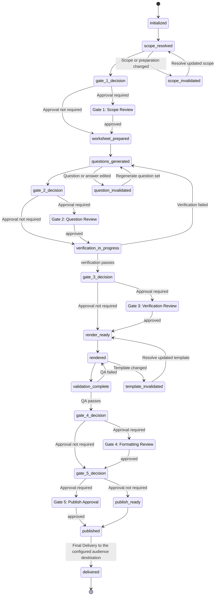
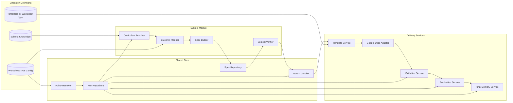
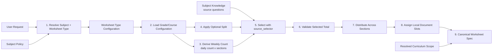
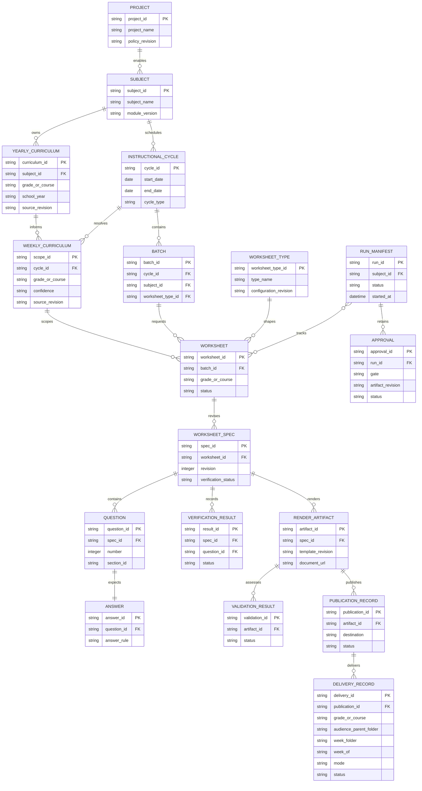
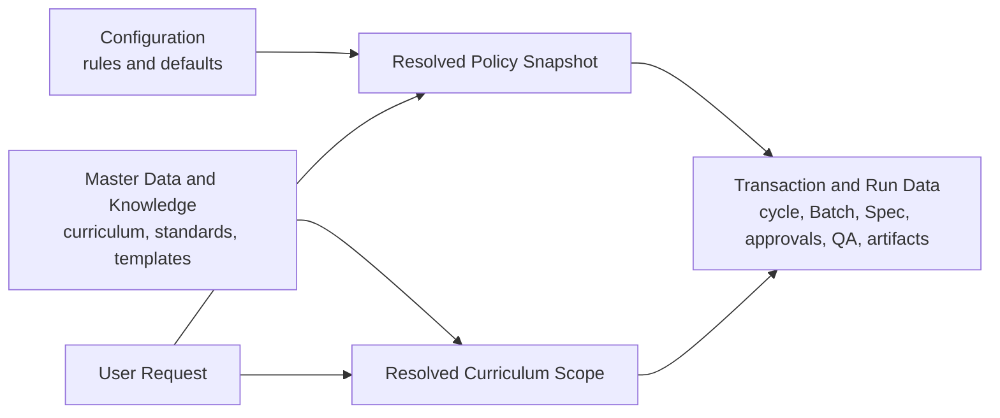
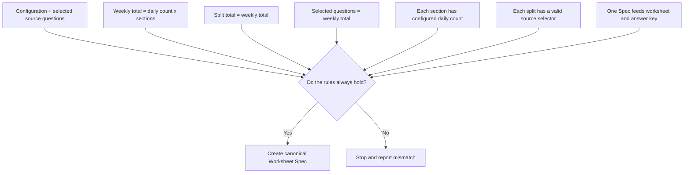

# MTS Worksheet and Assessment Generation - M4 Detailed System Design

Status: Proposed for M4 design review

## Table of Contents

- [MTS Worksheet and Assessment Generation - M4 Detailed System Design](#mts-worksheet-and-assessment-generation---m4-detailed-system-design)
  - [Table of Contents](#table-of-contents)
  - [1. Purpose And Authority](#1-purpose-and-authority)
  - [2. Detailed Lifecycle State Machine](#2-detailed-lifecycle-state-machine)
    - [2.1 Gate Contract](#21-gate-contract)
    - [2.2 Invalidation Contract](#22-invalidation-contract)
  - [3. Module And Interface Design](#3-module-and-interface-design)
    - [3.1 C3 Component Design](#31-c3-component-design)
    - [3.2 C4 Implementation Mapping](#32-c4-implementation-mapping)
    - [3.3 Shared Core Interfaces](#33-shared-core-interfaces)
    - [3.4 Subject Module Interface](#34-subject-module-interface)
    - [3.5 Worksheet Type Interface](#35-worksheet-type-interface)
      - [3.5.1 Weekly Worksheet Spec Preparation Flow](#351-weekly-worksheet-spec-preparation-flow)
      - [3.5.2 Count Semantics](#352-count-semantics)
    - [3.6 Google Docs/Drive Adapter Contract](#36-google-docsdrive-adapter-contract)
    - [3.7 Question Diversity, Difficulty, and Topic-Override Planning](#37-question-diversity-difficulty-and-topic-override-planning)
      - [Inputs](#inputs)
      - [How 100% of a day's slots are decided — three layers, in order](#how-100-of-a-days-slots-are-decided--three-layers-in-order)
      - [Worked example](#worked-example)
      - [Tuning guide](#tuning-guide)
      - [Content-authoring caution: one template per skill label, not one template for several](#content-authoring-caution-one-template-per-skill-label-not-one-template-for-several)
    - [3.8 Notation and Text-Formatting Contract](#38-notation-and-text-formatting-contract)
  - [4. Detailed Entity Relationship Design](#4-detailed-entity-relationship-design)
  - [5. Data Classification, Ownership, And Contracts](#5-data-classification-ownership-and-contracts)
    - [5.1 Data Classification And Ownership](#51-data-classification-and-ownership)
    - [5.2 Data Creation Sequence](#52-data-creation-sequence)
    - [5.3 Configuration File Contracts](#53-configuration-file-contracts)
    - [5.4 Master Data And Knowledge Contracts](#54-master-data-and-knowledge-contracts)
    - [5.5 Transaction And Run Data Contracts](#55-transaction-and-run-data-contracts)
    - [5.6 Shared Worksheet Spec](#56-shared-worksheet-spec)
    - [5.7 Run Manifest](#57-run-manifest)
    - [5.8 Extension Registration Contracts](#58-extension-registration-contracts)
  - [6. Responsibility And Technology Design](#6-responsibility-and-technology-design)
    - [6.1 Detailed Responsibility Allocation](#61-detailed-responsibility-allocation)
    - [6.2 Detailed Technology Boundaries](#62-detailed-technology-boundaries)
  - [7. File And Ownership Design](#7-file-and-ownership-design)
  - [8. Test Design](#8-test-design)
  - [9. M5 Implementation Sequence](#9-m5-implementation-sequence)
  - [10. M4 Review Checklist](#10-m4-review-checklist)
  - [Appendix A - Spec Preparation Validation Rules](#appendix-a---spec-preparation-validation-rules)

## 1. Purpose And Authority

This document turns the approved M3 Architecture into implementable contracts. It is derived from the M1 Product Idea, M2 Requirements, and M3 Architecture. It defines detailed state, data, module, adapter, extension, and test contracts; it does not authorize implementation until M4 review is complete.

Math is the first implementation baseline. ELA and the SAT, SAT Mini, ACT, and ACT Mini Worksheet Types use the same contracts but cannot be enabled until their extension packages meet `FR-SP-014`.

## 2. Detailed Lifecycle State Machine

A Run is a durable execution record. Each Worksheet or assessment artifact in the Run progresses independently after its Batch is prepared.



  Invalidation states make the recovery boundary explicit. A Question edit invalidates verification and downstream artifacts; a scope change invalidates Questions and downstream artifacts; and a template change invalidates rendering, validation, and publication state. Section 2.2 remains the authoritative invalidation contract.

### 2.1 Gate Contract

| Gate | Required input revision | Persisted approval fields | Allows transition to |
|---|---|---|---|
| Gate 1: Scope Review | Weekly/assessment scope | `gate`, `status`, `artifact_revision`, `approved_at`, `reviewer`, `notes` | `worksheet_prepared` |
| Gate 2: Question Review | Complete editable question set | Same fields | `verification_in_progress` |
| Gate 3: Verification Review | Verification summary and item results | Same fields | `render_ready` |
| Gate 4: Formatting Review | Rendered student/key artifacts and QA result | Same fields | `publish_approval_pending` |
| Gate 5: Publish Approval | Final validation and intended publication pair | Same fields | `published` |

Gate 5 authorizes both publication and the subsequent Final Delivery of the same approved revision. Final Delivery adds no gate of its own; it may never run against an artifact revision Gate 5 has not approved.

A rejection, expired approval, or changed source revision blocks the associated transition. An approval never applies to a later revision.

### 2.2 Invalidation Contract

| Changed input | Invalidates | Preserves |
|---|---|---|
| User override or resolved policy | Affected scope, Worksheet preparation, questions, and downstream evidence | Unaffected Worksheets and independent Batch members |
| Curriculum scope | Affected Worksheet questions, verification, render, validation, and publication | Batch membership and unaffected grade/course scopes |
| Question or answer | That Question verification and affected Worksheet verification/render/validation/publication | Curriculum approval and unrelated Worksheets |
| Template revision | Affected template cache, rendered artifacts, validation, and publication | Approved scope, questions, and verification |
| Destination/naming configuration | Publication readiness and publication record | Scope, questions, verification, rendering, and validation |
| Audience destination or week-folder configuration | Delivery readiness and delivery record | Publication record and all upstream approvals |

## 3. Module And Interface Design

### 3.1 C3 Component Design



The C3 components are independently testable. Subject modules invoke shared core interfaces; delivery services never make curriculum or gate-policy decisions.

### 3.2 C4 Implementation Mapping

| C3 component | M5 module/file target | Main implementation responsibility |
|---|---|---|
| Policy Resolver | `src/runtime/policy.py` | Merge base, subject, Worksheet Type, and run-override configuration into an immutable snapshot. |
| Run Repository | `src/runtime/run_repository.py` | Create, validate, checkpoint, resume, and persist Run Manifests. |
| Gate Controller | `src/runtime/gates.py` | Enforce revision-scoped Gate 1-5 approvals and legal state transitions. |
| Spec Repository | `src/runtime/spec_repository.py` | Validate and persist immutable Worksheet Spec revisions before Gate 2; return a reference and fingerprint for the Run Manifest. |
| Curriculum Resolver | `subjects/<subject>/src/curriculum.py` | Resolve subject scope from knowledge, cache, and source-fallback policy. |
| Blueprint Planner | `subjects/<subject>/src/blueprint.py` | Apply Worksheet Type rules to the approved subject scope. |
| Spec Builder | `subjects/<subject>/src/generation.py` | Build the ordered Worksheet Spec from the approved blueprint. |
| Subject Verifier | `subjects/<subject>/src/verification.py` | Provide deterministic checks and required reasoning-review results. |
| Template Service | `src/rendering/template_service.py` | Resolve the shared registry entry, selected subject/type manifest, template pair, and revision/cache state. |
| Google Docs Adapter | `src/rendering/google_docs_adapter.py` | Copy masters, render projections, and inspect resulting documents. |
| Validation Service | `src/verification/validation_service.py` | Run shared content QA and combine subject/type-specific validation. |
| Publication Service | `src/verification/publication_service.py` | Publish approved artifact pairs and verify naming/destination. |
| Final Delivery Service | `scripts/deliver_weekly_worksheets.py` over `src/rendering/google_docs_adapter.py` | Resolve the per-grade audience destination, ensure the week folder, and distribute the published pair. |

No M5 file may combine subject semantics, shared gate control, and Google API I/O. That separation is the C4 enforcement of the M3 boundaries.

### 3.3 Shared Core Interfaces

| Interface | Input | Output | Failure behavior |
|---|---|---|---|
| `PolicyResolver.resolve` | Request, base config, subject config, Worksheet Type config, run overrides | Immutable policy snapshot | Reject unknown/invalid override. |
| `RunRepository.create_or_resume` | Request identity and policy snapshot | Run Manifest checkpoint | Reject incompatible resume revision. |
| `GateController.require_approval` | Gate, artifact revision, manifest | Approval or blocked state | Fail closed when approval is absent/rejected/stale. |
| `SpecRepository.write_revision` | Validated Spec and parent revision | Immutable Spec reference | Reject schema/lineage failure. Gate 2 cannot transition until every planned Worksheet has a persisted reference. |
| `TemplateService.resolve` | Subject, Worksheet Type, grade/course, template selection | Template pair and revision metadata | Resolve the shared registry to the subject/type manifest; reject unregistered, fallback-disallowed, or stale-uninspected templates. |
| `Renderer.render_pair` | Verified Spec reference, template pair, destination | Two staging Render Artifacts | Reject non-passing verification or master-write request. |
| `Validator.validate_pair` | Render artifacts and Spec reference | Content and visual QA record | Block final approval on any required QA failure. |
| `Publisher.publish_pair` | Gate 5 approval, validated pair, destination | Publication Record | Reject missing, mismatched, or incorrectly named pair. |
| `Deliverer.ensure_week_folder` | Grade audience parent destination, resolved week folder name | Week folder reference | Reuse an existing folder; reject an ambiguous duplicate name. |
| `Deliverer.deliver_pair` | Published pair, week folder, delivery mode | Delivery Record | Reject an unapproved/unpublished artifact, an unknown mode, or a grade with no configured destination. |

### 3.4 Subject Module Interface

Every subject module implements:

```text
resolve_curriculum(request, knowledge, policy) -> ResolvedScope
prepare_blueprint(scope, worksheet_type, policy) -> WorksheetPlan
build_spec(plan, approved_inputs) -> WorksheetSpec
verify_spec(spec, policy) -> VerificationResult
review_guidance(spec, policy) -> HumanOrAIReviewInstructions
render_requirements(spec, worksheet_type) -> SubjectRenderRequirements
validate_subject_output(artifacts, spec) -> SubjectValidationResult
```

Math uses deterministic calculation when possible and reasoning review otherwise. ELA adds passage-support, inference-evidence, distractor, grammar, and open-response checks. Future subjects must expose equivalent behavior, not bypass shared contracts.

### 3.5 Worksheet Type Interface

Every Worksheet Type declares:

```text
worksheet_type_id
compatible_subjects
sections and ordering
question-count and duration rules
scoring and answer-key rules
template selection rules
type-specific validation rules
type regression fixtures
```

#### 3.5.1 Weekly Worksheet Spec Preparation Flow

The following deterministic sequence is the design contract for preparing a Weekly Worksheet Spec.
It applies to every subject and grade/course. Subject-specific behavior supplies the source-question
selection policy; it does not change the shared count, validation, distribution, or Spec lifecycle.

1. Resolve **Subject + Worksheet Type**.
2. Load the selected grade/course configuration.
3. Derive `questions_per_week` from `questions_per_day x configured sections`.
4. Apply an optional configured split.
5. Select source questions using `source_selector`.
6. Validate the selected total.
7. Distribute questions across configured sections.
8. Assign local document slots.
9. Create one canonical Worksheet Spec.



The flow has explicit ownership boundaries:

| Flow responsibility | Owner | Source or mechanism |
|---|---|---|
| Subject and Worksheet Type routing | Shared runtime | Policy Resolver and active template registry |
| Grade/course defaults | Worksheet Type configuration | `grade_defaults` |
| Daily/weekly arithmetic | Shared runtime | Deterministic count validation |
| Optional distribution split | Worksheet Type configuration | `grade_split` and `source_selector` |
| Source-question meaning and selection | Subject module | Subject knowledge and subject-specific selection policy |
| Count and section reconciliation | Shared runtime | Blueprint/Spec preparation validation |
| Local document slot assignment | Renderer | Template placeholder/layout contract |
| Canonical content record | Shared Spec lifecycle | Immutable Worksheet Spec revision |

The preparation rules and pass/fail visualization are provided in **Appendix A - Spec Preparation
Validation Rules**. The builder must apply those rules before creating the Spec and stop with a
reported mismatch when any rule fails.

#### 3.5.2 Count Semantics

Counts are configuration values, not agent assumptions:

```text
Weekly: questions_per_week = questions_per_day x configured sections
Single-sheet: questions_per_worksheet = count in one artifact
```

For combined products, `grade_split` distributes the combined weekly total and must sum to
`questions_per_week`. It is not multiplied by the number of days. Optional `source_selector` values
identify the source group for each split entry. The builder must fail closed on any count, split, or
section mismatch. Template slot capacity never changes the logical question count.

SAT/ACT Worksheet Types define their approved scope only after their respective M1/M2 artifacts are added. “Mini” types must be separate type IDs, not informal count overrides, so their time, sections, scoring, and templates remain testable.

### 3.6 Google Docs/Drive Adapter Contract

The adapter separates external I/O from workflow policy:

1. `copy_master(template_id, destination, name)` must create a new document; it may never update a master.
2. `render_document(copy_id, projection)` consumes a projection generated from the verified Spec revision.
3. `inspect_document(copy_id)` returns text/structural evidence needed for automated QA.
4. `publish_pair(student_artifact, key_artifact, destination)` confirms both files, names, parent folders, and links before recording success.
5. `ensure_child_folder(parent_id, name)` resolves a named child folder under an audience destination, creating it only when absent and refusing an ambiguous duplicate name, so delivery is idempotent.
6. `deliver_pair(student_artifact, key_artifact, destination, mode, deliver_answer_key)` distributes an already-approved pair; it never renders, edits, or re-verifies content.
7. Retryable external failures are recorded in the Run Manifest. Nonretryable failures return a blocked state and preserve upstream approvals.

For variable-count Weekly Worksheets, template question slots are layout capacity, not required
output. The Worksheet Type configuration is authoritative for `questions_per_day` and
`questions_per_week`. A renderer must map globally numbered Spec questions to local day slots,
populate only the configured count, remove unused numbered placeholder paragraphs, and validate that
the final student and answer-key documents contain no empty numbered rows or unresolved placeholders.

Numeric answer-key display is rounded via `display_answer(value, decimal_places, noise_threshold)`
(`scripts/render_weekly_specs_to_drive.py`), defaulting to `config/base.yaml`
`formatting.answer_decimal_places` (`2`). Rounding only applies **when relevant**: a float is shown
as-is if its raw value already has `noise_threshold` (default `3`) decimal digits or fewer — a clean,
intentional value like `0.125` or `9.0` is never truncated or padded. Only floats with *more* raw
decimal digits (almost always floating-point noise from an irrational computation, e.g.
`3.9999999999999996` from `64**(1/3)`) get rounded to `decimal_places` for display. Rounding is
display-only — it never touches the Spec's stored `answer` value used for verification. Lists/tuples
(e.g. prime-factorization or coordinate-transformation answers) apply the same rule element-wise;
integers pass through unchanged.

**Known gap (2026-08-28):** `p0_runtime.targeted_text_qa_v2` assumes *global* question numbering
(literal `"N."` for every `N` in `1..question_count`) and does not fit the Weekly Worksheet's *local*
per-day numbering (1..`questions_per_day`, repeated each day) described above. Using it against a
real Weekly render produces false failures. Until `targeted_text_qa_v2`/`validate_subject_output` are
made worksheet-type-aware, Weekly Worksheet QA must use a per-day-numbering-aware check instead (see
the `weekly_text_qa` pattern in the Weekly execution runbook) — do not silently skip QA to work around
this; use the corrected check.

### 3.7 Question Diversity, Difficulty, and Topic-Override Planning

Question authoring (the actual prompts/numbers) is agent-owned, but its *shape* is planned and
validated by deterministic code (`subjects/math/src/question_plan.py`), not left to authoring
judgment alone. This section is the full reference for that planning: every input, and exactly how
each of a day's slots (100% of that day's questions) is decided.

#### Inputs

| Input | Where it comes from | Default |
|---|---|---|
| `sections` | The worksheet type's day list, e.g. `["monday", ..., "friday"]` (`config/worksheet-types/weekly-worksheet.yaml` `sections`) | required |
| `slots_per_day` | The grade's `questions_per_day` for the resolved worksheet type (`config/worksheet-types/weekly-worksheet.yaml` `grade_defaults.<grade>.questions_per_day`) | required |
| `primary_skills` | The resolved curriculum scope's *current*-week topics for that grade (`weekly_pacing_cache` `topics`, via `MathSubjectModule.resolve_curriculum`) | required, non-empty |
| `spiral_skills` | The resolved curriculum scope's *spiral*-review topics for that grade (`weekly_pacing_cache` `spiral`) | optional (`None`/`[]` disables spiral injection) |
| `difficulty` | `/generate-worksheet` `difficulty` parameter | `medium_plus` (`config/base.yaml` `question_design.difficulty.default`) |
| `diversity` | `/generate-worksheet` `diversity` parameter | `medium_plus` (`config/base.yaml` `question_design.diversity.default`) |
| `topic_overrides` | `/generate-worksheet` `topic_overrides` parameter, parsed by `question_plan.parse_topic_overrides`, sliced to the grade being planned | none |

#### How 100% of a day's slots are decided — three layers, in order

Each day's `slots_per_day` slots are filled by three independent layers applied **in this order**;
each layer only ever decides *part* of the slot's final content, and every slot ends up with exactly
one `skill` and one `difficulty`:

**Layer 1 — `topic_overrides` claims a fixed share of slots first.**
For each override entry (in the order given), its slot count is resolved (`N%` → `round(slots_per_day *
N / 100)`, or a literal `count`), and that many slots are placed **evenly spaced** across the whole day
via `_assign_evenly_spaced` (target index `(i + 0.5) * slots_per_day / count`, so a 60%-of-10 override
lands near slots 1, 3, 5, 6, 8, 10 — not bunched at the start). Multiple overrides for the same day
claim their shares in sequence, probing forward to the next free slot on any collision. If the combined
claimed slots would exceed `slots_per_day`, `build_day_plan` raises rather than silently truncating.
Slots claimed here get their override's `topic` as their `skill` and are tagged `topic_override: true`.

**Layer 2 — the remaining slots are filled by the primary/spiral rotation, sized by `diversity`.**
Whatever slots Layer 1 didn't claim (in their original left-to-right order) are handed to
`build_skill_sequence`, sized to exactly that remaining count. `diversity` controls two things here:
the `spiral_interval` (every Nth slot **within this remaining sequence**, not the original day
numbering, is a spiral-review skill instead of the next current-week skill) and, separately, the
`min_distinct_skills_per_day` that `validate_progression` will require later. Primary skills rotate
round-robin (`primary_skills[index % len(primary_skills)]`), guaranteeing no two *primary* slots in a
row repeat as long as 2+ primary skills are configured.

| Diversity | Min distinct skills/day | Spiral every Nth remaining slot |
|---|---|---|
| Low | 1 | never |
| Low+ | 2 | 6th |
| Medium | 2 | 5th |
| **Medium+ (default)** | **3** | **4th** |
| High | 4 | 3rd |
| Very High | 5 | 2nd |

**Layer 3 — `difficulty` is computed independently for every slot, regardless of Layer 1/2.**
`difficulty_for_slot` never looks at which skill occupies a slot; it only uses the slot's *position*:
`progress = 0.5 × (day_index / (num_days - 1)) + 0.5 × (slot_index / (slots_per_day - 1))`, then
`rank = round(start_rank + (end_rank - start_rank) × progress)`, where `(start_rank, end_rank)` is the
band `difficulty` selects on the shared 6-point scale:

| Difficulty | Band (0=low .. 5=very_high) |
|---|---|
| Low | 0 – 1 |
| Low+ | 0 – 2 |
| Medium | 1 – 3 |
| **Medium+ (default)** | **1 – 4** |
| High | 2 – 5 |
| Very High | 3 – 5 |

Because Layer 3 is fully decoupled from Layers 1–2, a topic-override slot on Friday afternoon is just
as hard as a rotation slot in the same position — overrides change *what* is asked, never *how hard*.

#### Worked example

Grade 1, Monday, `slots_per_day=10`, `primary_skills=["addition_within_20", "subtraction_within_20"]`,
`spiral_skills=["counting_sequence"]`, `difficulty=medium_plus`, `diversity=medium_plus`,
`topic_overrides=[{"topic": "count_on_and_back", "kind": "percent", "value": 60}]`:

1. **Layer 1**: 60% of 10 = 6 override slots, evenly spaced → 0-indexed slots `{0, 2, 4, 5, 7, 9}`
   (1-indexed: 1, 3, 5, 6, 8, 10) get `skill = "count_on_and_back"`.
2. **Layer 2**: the 4 remaining 0-indexed slots `[1, 3, 6, 8]` (1-indexed: 2, 4, 7, 9) go through
   `build_skill_sequence(length=4, diversity="medium_plus")`. `spiral_interval=4`, so only the *4th
   remaining slot* (1-indexed day slot 9) is spiral; the other 3 rotate through the 2 primary skills:
   `addition_within_20, subtraction_within_20, addition_within_20`.
3. **Layer 3**: `day_index=0` (Monday), band `(1, 4)` → every slot this day resolves to rank 1–2
   (`low_plus`/`medium`), independent of the skill assigned above.

| Slot (1-indexed) | Skill (Layer 1 or 2) | Difficulty (Layer 3) |
|---|---|---|
| 1 | count_on_and_back (override) | low_plus |
| 2 | addition_within_20 (primary) | low_plus |
| 3 | count_on_and_back (override) | low_plus |
| 4 | subtraction_within_20 (primary) | medium |
| 5 | count_on_and_back (override) | medium |
| 6 | count_on_and_back (override) | medium |
| 7 | addition_within_20 (primary) | medium |
| 8 | count_on_and_back (override) | medium |
| 9 | counting_sequence (spiral) | medium |
| 10 | count_on_and_back (override) | medium |

The same day's Friday counterpart (`day_index=4`) recomputes only Layer 3 against the same band,
shifting every slot's difficulty up (band midpoint moves from ~1.0 to ~2.5–4.0) while Layers 1–2 (which
skill goes where) are recomputed fresh per day from the same `topic_overrides`/`primary_skills`/
`spiral_skills` inputs — a day is never a copy of another day's skill assignment, only its *shape*.

#### Tuning guide

- **Want more forced-topic coverage this week?** Raise the `topic_overrides` percentage/count for that
  grade — it directly reduces how many slots Layer 2 gets, without touching difficulty.
- **Want more variety in the non-override slots?** Raise `diversity` — it lowers the spiral interval
  (spiral shows up more often) and raises the distinct-skill minimum `validate_progression` enforces.
- **Want a gentler or steeper ramp?** Change `difficulty` — it only ever shifts the `(start_rank,
  end_rank)` band; it never changes which skill is asked, so it composes cleanly with any
  `topic_overrides`/`diversity` setting.
- **Want to check whether a hand-edited spec still satisfies the intended shape?** Run
  `MathSubjectModule.check_diversity_and_progression(spec, diversity=<level>)` — it recomputes ranks
  from each question's stored `difficulty` label and requires both non-decreasing *and* net-increasing
  difficulty per day, plus the diversity minimum, using the exact same rank table as Layer 3.

`MathSubjectModule.build_week_plan(...)` resolves all inputs above into one slot-by-slot plan
(`{day_id: [{slot, skill, difficulty}, ...]}`) before authoring; `check_diversity_and_progression(spec)`
validates the authored result before it is persisted (see `subjects/math/skills/weekly-worksheet-execution-runbook.md`
step 8a/8d).

#### Content-authoring caution: one template per skill label, not one template for several

The plan only guarantees distinct *skill labels* per slot; it cannot guarantee distinct *question
content* — that is authoring's responsibility. A real defect (2026-08-28, Grades 9-10) showed the
failure mode: three different skill labels (`equations/inequalities`, `create equations`, `functions`)
were all authored through one shared `f(x) = mx + b` template, so ~60% of a combined Math 1/Math 2
worksheet was near-duplicate questions wearing different skill-label "name tags" — diversity theater
that still passes `validate_progression` (which only checks label counts) while visibly failing the
actual goal. **Rule: every skill label authoring maps to must have its own genuinely distinct
template/phrasing**, and per-slot parameters must be seeded so that two different skills at the same
day/difficulty never coincidentally produce identical numbers.

### 3.8 Notation and Text-Formatting Contract

Worksheet prompts must never leak raw code syntax (`25**(1/2)`, `x^2`, `*`, `/`, `>=`) to students.
`subjects/math/src/notation.py` is the single source for Grade 1-12 display formatting:

| Category | Provided by | Typical grade band |
|---|---|---|
| Exponents/roots | `superscript()`, `subscript()`, `radical(n, index)` | 5+ (squares/cubes), 8+ (general/rational exponents) |
| Fractions | `fraction(numerator, denominator)` (precomposed glyph, e.g. `½`, else plain `a/b`) | 1+ |
| Basic operators | `TIMES`, `DIVIDE`, `PLUS_MINUS`, `APPROX`, `NOT_EQUAL`, `LESS_EQUAL`, `GREATER_EQUAL` | 1+ (never raw `*`/`/`/`>=`/`<=`) |
| Geometry | `DEGREE`, `ANGLE`, `PARALLEL`, `PERPENDICULAR`, `PI`, `TRIANGLE` | 4+ |
| Sets/intervals | `ELEMENT_OF`, `UNION`, `INTERSECTION`, `SUBSET`, `INFINITY`, `interval(a, b, left_closed, right_closed)` | 8-12 |
| Absolute value | `absolute_value(expr)` → `\|expr\|` | 6+ |
| Advanced | `THETA`, `DELTA` | 9-12 (limited use today) |

`GRADE_BAND_NOTATION` is an advisory (not enforced) lookup of what to introduce/avoid per grade band;
authoring still uses judgment for grade-appropriateness — this table does not replace the existing
`review_guidance` reasoning-review requirement.

### 3.9 Staging And Final Delivery Contract

Distribution has two distinct phases. Confusing them is what this contract prevents.

| Phase | Purpose | Location | Audience |
|---|---|---|---|
| Staging | Render, correct, verify, QA, and hold approved artifacts | `config/base.yaml` `publishing.staging.render_folder_id`, then `.approved_folder_id` (mirrored by `outputs-copilot/`) | Authoring and review only |
| Final Delivery | Distribute an approved, unmodified pair | `Week_<WEEK_OF>` under `config/<subject>.yaml` `publishing.final_delivery.destinations_by_grade.<grade>.folder_id` | Parents/students |

Rules:

1. Final Delivery is a distribution step, never an authoring step. It copies existing documents; it
   never renders, edits, re-numbers, or re-verifies content.
2. It requires a recorded Gate 5 approval for the delivered revision. It introduces no new gate.
3. Destinations are configuration, resolved per grade. A grade with no configured destination is a
   fail-closed error, never a fallback to a shared folder.
4. `WEEK_OF` is the ISO Monday of the delivered instructional week, resolved against
   `config/base.yaml` `calendar.week_1_start`. The folder name comes from
   `final_delivery.week_folder_pattern`, so the audience-facing naming stays configurable.
5. Delivery is idempotent: `reuse_existing_week_folder` requires resolving an existing week folder
   rather than creating a second one, so a re-delivery corrects a week in place.
6. `final_delivery.mode: copy` is the default so Staging survives delivery as the audit trail;
   `move` is available where staging retention is not wanted.
7. `final_delivery.deliver_answer_key` controls whether the Answer Key accompanies the Student
   Worksheet, because audience visibility of keys is a policy decision, not a rendering one.
8. Each delivery writes a Delivery Record to the Run's evidence (`delivered-artifacts.json`) naming
   the source artifacts, week, mode, destination folders, and resulting document links.

## 4. Detailed Entity Relationship Design

This ERD is the detailed implementation model. It shows ownership and reference relationships without treating the Run Manifest as a second source of Worksheet content.



## 5. Data Classification, Ownership, And Contracts

The root `schemas/` directory owns shared contracts. `subjects/<subject>/schemas/` may add subject-specific definitions and must compose with, not replace, shared contracts. Existing P0 schemas remain compatibility inputs until M5 migration replaces them with versioned contracts.

### 5.1 Data Classification And Ownership

| Data class | Answers | Created/changed by | Reuse rule | Primary locations |
|---|---|---|---|---|
| Configuration | How should the system behave? | Approved configuration change or current-run override | Reusable defaults; a run override is never persisted unless explicitly approved. | `config/`, `subjects/<subject>/config/` |
| Master data and knowledge | What stable, approved facts does the system know? | Curriculum/template/source management | Reusable across Runs; changes are versioned with source provenance. | `subjects/<subject>/knowledge/`, `templates/by-worksheet-type/` |
| Transaction and run data | What happened for this request, cycle, Batch, Worksheet, and Run? | A specific worksheet-generation Run | Never reused as a default; changed records create a new revision or Run evidence record. | `runs/<subject>/<run_id>/` |

Configuration contains variable behavior: enabled subjects/grades, Worksheet Type rules, gates, counts, duration, naming, destinations, cache thresholds, school-year week numbering (`calendar.week_1_start`), question-authoring defaults (`question_design.difficulty`/`.diversity`), and answer-display formatting (`formatting.answer_decimal_places`). It must not contain historical curriculum evidence, question content, gate approvals, or Run results.

Master data and knowledge contains versioned reusable facts: subject/grade catalog entries, standards, yearly progression, curriculum sources, approved template metadata, template revisions, layout contracts, and approved fallback relationships. A template manifest is master data because it describes an approved, versioned external asset; a Worksheet Type configuration selects a template but does not redefine the template's inspected structure.

Transaction and run data contains event-specific records: request, effective policy snapshot, Instructional Cycle, resolved Weekly Curriculum, Batch, Worksheet Spec revision, verification results, approvals, render artifacts, QA results, publication record, and telemetry. It must reference configuration and master-data revisions rather than copy them as new sources of truth.



### 5.2 Data Creation Sequence

Before shared runtime implementation, M5 Data Foundation may create and validate baseline Configuration and Master Data files. It must not create real Transaction/Run Data without a request; only schema fixtures and examples may exist before an actual run.

1. Create configuration files and schemas for shared defaults, subjects, and Worksheet Types.
2. Create master-data registries and schemas for subject/grade catalogs, source metadata, template manifests, and curriculum knowledge.
3. Map existing Math curriculum knowledge and template manifest files into the master-data model without losing provenance.
4. Create transaction-data schemas and non-production test fixtures for Runs, Specs, approvals, artifacts, QA, and publication records.
5. Validate all baseline files and preserve the existing Math P0 data paths until the M5 migration gate passes.

### 5.3 Configuration File Contracts

```text
config/
  base.yaml                              # Shared defaults and lifecycle settings
  math.yaml                              # Math enablement and subject defaults
  ela.yaml                               # ELA enablement and subject defaults
  worksheet-types/
    <worksheet-type>.yaml                # Counts, sections, duration, scoring, template selection, validation
```

A Worksheet Type file is configuration because its behavior is intentionally changeable. It selects a
subject/type template manifest by path and stable template key. The shared registry validates that
the subject/type is registered and active. The selected manifest owns the external student and
answer-key IDs, live revisions, inspected layout, and cache state. A Worksheet Type must not redefine
that inspected structure. Class and Weekly Math use separate manifests; a fallback is explicit in
the registry and is not implied by a missing manifest.

Distribution locations are configuration for the same reason. `base.yaml` owns audience-neutral
distribution behavior (`publishing.staging`, `publishing.final_delivery` mode, week-folder pattern,
reuse, answer-key policy); `<subject>.yaml` owns the per-grade audience destinations
(`publishing.final_delivery.destinations_by_grade`), because which folder a grade's families watch is
a subject-scoped fact. No destination ID may be embedded in a script or adapter.

### 5.4 Master Data And Knowledge Contracts

```text
subjects/
  <subject>/
    knowledge/
      grade-course-catalog.json          # Supported grades/courses
      yearly-curriculum.json             # Progression, prerequisites, approximate sequence
      standards.json                     # Authoritative standards cache
      curriculum-sources.json            # Source authority, freshness, provenance
templates/
  by-worksheet-type/
    template-manifest.json               # Shared subject/Worksheet Type registry and routing
subjects/
  <subject>/config/template-manifests/
    <worksheet-type>.json                # Subject/type master IDs, revisions, layout, cache state
```

Master Data changes require a version/revision update and invalidate only dependent Transaction/Run Data under the Section 2.2 invalidation contract.

### 5.5 Transaction And Run Data Contracts

```text
runs/
  <subject>/<run_id>/
    run-manifest.json                    # Run state and cross-record references
    resolved-policy.json                 # Immutable effective configuration snapshot
    curriculum/<scope_id>.json           # Resolved scope and provenance
    batches/<batch_id>.json              # Expected Worksheet set
    specs/<spec_id>-r<revision>.json     # Immutable Worksheet Spec revision
    verification/<spec_id>-r<revision>.json
    approvals/<gate>-<revision>.json
    qa/<artifact_id>.json
    artifacts/<artifact_id>.json
    publication/<publication_id>.json
```

Transaction records are append-only evidence wherever possible. A correction creates a revision record and preserves the previous record for auditability; it does not overwrite a prior approved Worksheet Spec, approval, verification result, or publication record.

### 5.6 Shared Worksheet Spec

`schemas/worksheet-spec.schema.json` will become the cross-subject `WorksheetSpec` schema.

| Field group | Required fields | Purpose |
|---|---|---|
| Identity | `spec_version`, `spec_id`, `subject`, `worksheet_type`, `worksheet_id`, `revision` | Identifies one immutable logical content revision. |
| Scope | `instructional_cycle`, `grade_or_course`, `weekly_curriculum`, `source_provenance`, `confidence` | Records approved instructional or assessment scope. |
| Blueprint | `worksheet_type`, `questions_per_day`, `questions_per_week` or `questions_per_worksheet`, `sections`, `duration_minutes`, `scoring_policy`, `template_profile` | Defines profile-driven structure and delivery expectations; count names must match the Worksheet Type scope and derived totals must pass consistency rules. |
| Content | `questions[]` with `id`, `number`, `section_id`, `prompt`, `answer`, `skill`, `difficulty`, `standards`, `answer_rule` | Is the only content source for student and key projections. |
| Verification | `verification_status`, `question_results[]`, `reasoning_review_status` | Records readiness and per-question proof. |
| Lineage | `created_at`, `created_by`, `parent_revision`, `input_revisions` | Supports audit and dependency invalidation. |

A `Question` is immutable within a Spec revision. Editing creates a new WorksheetSpec revision with a `parent_revision` reference.

### 5.7 Run Manifest

`schemas/run-manifest.schema.json` will define the single Run record under `runs/<subject>/<run_id>/run-manifest.json`.

| Field group | Required fields | Purpose |
|---|---|---|
| Identity | `manifest_version`, `run_id`, `subject`, `worksheet_type`, `status`, `started_at` | Identifies and classifies the execution. |
| Request and policy | `request`, `resolved_policy`, `policy_revision`, `overrides` | Records user intent and nonpersistent effective configuration. |
| Scope and Batch | `instructional_cycle`, `weekly_curricula[]`, `batch`, `worksheets[]` | Links independent Worksheet/assessment members. |
| State and approvals | `stages`, `checkpoints`, `approvals[]`, `invalidations[]` | Enables legal resume and revision-scoped gates. |
| Evidence | `verification`, `qa`, `artifacts[]`, `publication` | Retains evidence without duplicating Spec content. |
| Telemetry | `timing`, `tool_calls`, `cache`, `retries`, `token_usage` | Supports FF-08 and FF-12; token usage is `null` when not authoritative. |

The manifest stores a Spec ID and revision, not copies of questions or answers.

### 5.8 Extension Registration Contracts

Each enabled extension registers two independent definitions:

| Contract | Location | Required declaration |
|---|---|---|
| Subject module | `subjects/<subject>/` | Subject ID, supported grades/courses, knowledge sources, generation guidance, verifier, render/QA additions, tests. |
| Worksheet Type | `config/worksheet-types/<type>.yaml` | Type ID, compatible subjects, sections, counts, duration, scoring, template selection, validation rules, tests. |

A Worksheet Type can be compatible with multiple subjects. A Worksheet Type does not define curriculum facts or subject reasoning rules. A subject module does not override shared gate, evidence, or publication behavior.

## 6. Responsibility And Technology Design

### 6.1 Detailed Responsibility Allocation

| Responsibility | Actor | Enforced by | M5 evidence |
|---|---|---|---|
| Approve scope, questions, verification, formatting, and publication | Human | Gate Controller records a revision-scoped Approval | Run Manifest approval record |
| Interpret incomplete curriculum evidence and generate/review non-deterministic content | AI | Subject skill/workflow input-output contract | Spec lineage and reasoning-review record |
| Compute answers, validate schemas, enforce state, naming, and pair integrity | Software | Shared core and subject verifier code | Unit/integration test and Run Manifest result |
| Maintain standards, curriculum sources, templates, and examples | Knowledge owner | Versioned knowledge/template records | Source/template revision reference |
| Set counts, duration, gates, destinations, and Worksheet Type rules | Configuration owner | YAML schema and Policy Resolver | Resolved policy snapshot |

### 6.2 Detailed Technology Boundaries

| Concern | Technology boundary | Rule |
|---|---|---|
| Deterministic domain and lifecycle logic | Python | Must be independently unit-testable and have no direct Google API dependency. |
| Changeable policy | YAML plus schema validation | Must be resolved once into the Run policy snapshot; code must not embed per-type counts or IDs. |
| Interchange/persistence contracts | JSON and JSON Schema | Worksheet Specs and Run Manifests are versioned, validated records. |
| External documents | Google Docs/Drive adapter | Only adapter modules import Google client libraries. |
| Secrets | Environment or local untracked secret references | Credentials are never persisted in Specs, Run Manifests, or generated artifacts. |
| Test automation | pytest-compatible Python tests and mocked Google APIs | Live external calls are excluded from deterministic CI tests. |

## 7. File And Ownership Design

```text
config/
  base.yaml                              # Shared lifecycle and platform defaults
  math.yaml                              # Math subject-wide policy and defaults
  ela.yaml                               # ELA subject-wide policy and defaults
  worksheet-types/
    weekly-worksheet.yaml                # Weekly sections, counts, and template selection
    class-worksheet.yaml                 # Single-sheet class counts and template selection
    sat.yaml                              # SAT Worksheet Type rules and profile
    sat-mini.yaml                         # SAT Mini Worksheet Type rules and profile
    act.yaml                              # ACT Worksheet Type rules and profile
    act-mini.yaml                         # ACT Mini Worksheet Type rules and profile
schemas/
  worksheet-spec.schema.json             # Canonical worksheet content and verification contract
  run-manifest.schema.json               # Run state, approvals, artifacts, and telemetry contract
  definitions/
    approval.schema.json                 # Revision-scoped human gate decision
    verification-result.schema.json      # Per-question and aggregate verification evidence
    render-artifact.schema.json          # Copied worksheet/key document record
    publication-record.schema.json       # Final paired publication result
src/
  runtime/
    policy.py                            # Resolve immutable Subject + Worksheet Type policy
    run_repository.py                    # Persist and resume Run Manifests
    gates.py                             # Enforce approvals and dependency invalidation
    spec_repository.py                   # Persist immutable Worksheet Spec revisions
  rendering/
    template_service.py                  # Resolve template registry and revision metadata
    google_docs_adapter.py               # Copy, render, inspect, publish, and deliver Google Docs
  verification/
    validation_service.py                # Run content and visual QA validation
    publication_service.py               # Publish validated worksheet/key pairs
subjects/
  math/                                  # Math knowledge, module, templates, and tests
  ela/                                   # ELA knowledge, module, templates, and tests
runs/
  <subject>/<run_id>/                    # Durable evidence for one execution attempt
    run-manifest.json                    # Run identity, state, approvals, and references
    specs/<spec_id>-r<revision>.json     # Immutable canonical Worksheet Spec revision
    qa/                                   # Content, visual, and release QA evidence
    artifacts/                            # Rendered and published artifact records
    delivered-artifacts.json              # Final Delivery record for the batch
tests/
  shared/                                # Cross-subject runtime and contract tests
  math/                                  # Math subject and curriculum tests
  ela/                                   # ELA subject and curriculum tests
  profiles/                              # Worksheet Type profile tests
  integration/                           # Cross-component lifecycle tests
  golden-examples/                       # Protected expected behavior examples
```

This is a target structure for M5 migration. Existing P0 files remain in place until their replacement is implemented and regression-tested.

## 8. Test Design

| Test layer | Contract under test | Required fixtures |
|---|---|---|
| Unit | Policy resolution, schemas, gate transitions, invalidation, deterministic Math methods | Valid/invalid requests, approval revisions, edited Spec revisions |
| Subject | Math deterministic/reasoning checks; ELA language checks | Grade/course scope and question examples per subject |
| Profile | Weekly, Class, Homework, Compact, Speed Math, SAT/ACT profiles | Valid and invalid blueprint/count/time/score configurations |
| Integration | Spec -> verification -> copied-template render -> QA -> approved paired publication -> per-grade Final Delivery | Mock Google Docs/Drive and a verified Spec fixture |
| Regression | Preserve working `mts-new` Math behaviors during migration | Current Math fixtures, expected content/QA/manifest outcomes |
| Manual visual | Pagination, readability, gaps, wrapping, answer space, colors, key density | Rendered staging document links and recorded reviewer decision |

Each fitness function in M3 must map to at least one test fixture or a documented manual review record before the related feature can be production-ready.

## 9. M5 Implementation Sequence

1. Add shared contract definitions and schema validation while preserving P0 compatibility.
2. Implement policy snapshots, Run Manifest persistence, gate controller, and revision/invalidation mechanics.
3. Extract Math P0 helpers behind the Subject Module interface and preserve all existing Math tests.
4. Migrate Google Docs/Drive render and publishing scripts from `mts-new` behind adapters with mocked integration tests.
5. Add configuration-driven Final Delivery of published pairs into per-grade, per-week audience folders, with idempotent folder resolution and a persisted Delivery Record.
6. Add Worksheet Type registration and migrate existing Math Worksheet Types into type definitions.
7. Build the ELA extension package with approved ELA M1/M2 scope, knowledge, templates, verifier, and tests.
8. Add SAT, SAT Mini, ACT, and ACT Mini only after their profile requirements, scoring/validation rules, fixtures, and templates are approved.
9. Run the full Math regression gate and extension-isolation tests before replacing legacy workflow paths.

## 10. M4 Review Checklist

- Are data records owned by exactly one source and referenced elsewhere by ID/revision?
- Are all five gate transitions and invalidation rules complete and fail-closed?
- Can a subject/profile be added without changing shared lifecycle semantics?
- Are Google Docs/Drive calls confined to adapters?
- Are Staging and Final Delivery distinct, with delivery gated on Gate 5, destination-configured per grade, idempotent per week, and incapable of modifying content?
- Are every M3 fitness function and M2 NFR represented in the test design?
- Does the M5 sequence preserve the working Math baseline before extending ELA or SAT/ACT?

## Appendix A - Spec Preparation Validation Rules

In this document, an **invariant** means a rule that must always be true. These checks make the
Weekly Worksheet preparation flow concrete and explain what happens when a rule fails.



| Rule that must always hold | Concrete example | If it fails |
|---|---|---|
| Weekly total equals daily count times sections | `5 x 5 = 25` for combined Grades 9/10 | Stop; do not create the Spec |
| Split total equals weekly total | `13 + 12 = 25` | Stop; correct configuration |
| Selected questions equal the expected total | Select exactly 25 questions | Stop; do not render |
| Each section receives its configured daily count | Five sections receive 5 each | Stop; redistribute or correct config |
| Split source selectors resolve | `math_1 -> Grade 9`, `math_2 -> Grade 10` | Stop; identify the source groups |
| Worksheet and answer key use one Spec | Both derive from the same Spec revision | Stop; prevent mismatched artifacts |

The detailed validation contract is:

- `questions_per_week = questions_per_day x number_of_configured_sections` for Weekly Worksheets.
- An optional split sums exactly to `questions_per_week`.
- Every split entry has a resolvable `source_selector` when source groups are required.
- Selected questions equal `questions_per_week`.
- Sections contain the configured daily allocation.
- Local document slots are presentation positions and do not redefine canonical question numbers.
- The Worksheet Spec is the sole source for both the student worksheet and answer key.
