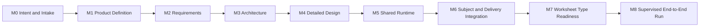

# M0-M8 Product and Feature Delivery Tracker

Status: Active
Last updated: 2026-08-28

## Purpose

This is a proactive checklist for a new product, a new feature, or an enhancement to an existing product. It records progress across the complete lifecycle, from human intent through a validated release and its first real run. It complements `plan-and-tasks.md`, which tracks implementation work only.

This document answers two separate questions:

1. Is the product capability and workflow implemented?
2. How far has the current supervised worksheet run progressed?

A milestone is not complete merely because code exists. It requires the stated artifact, review decision, validation evidence, and a recorded next action.

## How To Use This Tracker

Create one copy of this tracker for each product, feature, or enhancement. Set the scope before M0:

| Field | Value |
|---|---|
| Change type | `new product` / `new feature` / `enhancement` / `maintenance` |
| Initiative name | Replace with the product or feature name |
| Owner | Person accountable for the lifecycle |
| Requested date | Date the work entered the lifecycle |
| Target release/run | Intended release, cycle, or run identifier |
| Scope | What is included |
| Exclusions | What is explicitly not included |
| Current milestone | The first incomplete M0-M8 milestone |

### Status Vocabulary

Use only these status values:

- `Not started`
- `In progress`
- `Blocked`
- `Ready for review`
- `Approved`
- `Complete`
- `Deferred`

### Operating Rules

- Start at M0 for every new product or feature, even when the request appears small.
- For an enhancement, link the existing product intent and record only the changed intent, scope, and affected behavior; do not rewrite history.
- Do not mark a milestone complete without its exit evidence.
- Record blockers as a missing decision, artifact, test, permission, or failed check.
- Keep implementation detail in the implementation plan; keep this tracker focused on lifecycle readiness and evidence.
- Do not advance a downstream milestone when an upstream approval or artifact is missing.
- Use explicit human approvals at consequential review boundaries.

## Reusable M0-M8 Checklist

Copy this checklist into a new initiative tracker and replace the placeholders with links and evidence.

### M0 - Intent and Intake

- [ ] Capture the user problem and desired outcome.
- [ ] Identify users, stakeholders, owner, and decision makers.
- [ ] Classify the work: new product, feature, enhancement, or maintenance.
- [ ] Record constraints, assumptions, risks, exclusions, and success signals.
- [ ] Identify existing product behavior that must be preserved.
- [ ] Record the initial request and unresolved questions.

**Exit evidence:** Approved intent brief, scope boundary, owner, and success criteria.

### M1 - Product Definition

- [ ] Define or update product vocabulary and core entities.
- [ ] Identify affected workflows, users, integrations, and data.
- [ ] Define functional areas and responsibility boundaries.
- [ ] Identify compatibility, migration, and backward-compatibility expectations.
- [ ] Record the product decision and review status.

**Exit evidence:** Product definition/ontology reviewed and linked to M0 intent.

### M2 - Requirements and Acceptance

- [ ] Convert intent into functional requirements.
- [ ] Define non-functional requirements and quality thresholds.
- [ ] Define acceptance criteria and failure behavior.
- [ ] Identify human approval gates and accountability.
- [ ] Define configuration, source, privacy, security, and operational constraints.
- [ ] Map requirements to tests, evidence, and affected existing behavior.

**Exit evidence:** Approved requirements with acceptance criteria and traceability.

### M3 - Architecture

- [ ] Define system context and external dependencies.
- [ ] Assign ownership to shared core, subject/domain modules, adapters, and data.
- [ ] Define boundaries, interfaces, state, persistence, and failure paths.
- [ ] Decide what is deterministic software, AI-assisted, human-owned, or configuration-driven.
- [ ] Define extension and backward-compatibility strategy.
- [ ] Identify architecture risks and rejected alternatives.

**Exit evidence:** Reviewed architecture with component boundaries, data flow, and risk decisions.

### M4 - Detailed Design

- [ ] Define schemas, state transitions, APIs, and revision/invalidation rules.
- [ ] Define test strategy, fixtures, fitness functions, and manual review evidence.
- [ ] Define migration, rollback, observability, and operational procedures.
- [ ] Define content, visual, accessibility, security, and performance validation where applicable.
- [ ] Confirm configuration ownership and source-of-truth locations.
- [ ] Confirm the design can be implemented incrementally.

**Exit evidence:** Implementable design, validation plan, and approved release boundary.

### M5 - Core Implementation

- [ ] Implement the smallest bounded module or vertical slice.
- [ ] Add or update schemas and configuration.
- [ ] Preserve existing behavior through regression tests.
- [ ] Add focused tests for success, failure, invalidation, and resume paths.
- [ ] Validate diagnostics, parsing, type checks, lint, and security-sensitive changes.
- [ ] Update implementation tasks and record test results.

**Exit evidence:** Focused tests and integration checkpoint pass; no unresolved implementation blocker.

### M6 - Domain and Delivery Integration

- [ ] Integrate domain behavior with the shared lifecycle.
- [ ] Connect external systems through approved adapters.
- [ ] Verify permissions, credentials, configuration, and environment prerequisites.
- [ ] Test real or sandbox delivery paths, not only mocks, where feasible.
- [ ] Verify artifact synchronization, template/config fidelity, and failure recovery.
- [ ] Record operational evidence and known limitations.

**Exit evidence:** Integrated staging or sandbox run passes with durable evidence.

### M7 - Readiness and Activation

- [ ] Activate only the approved feature/product configuration.
- [ ] Verify plans, defaults, migrations, templates, data, and dependencies.
- [ ] Run regression, integration, and targeted quality checks.
- [ ] Confirm monitoring, support ownership, documentation, and rollback readiness.
- [ ] Confirm human gates and publication/release permissions.
- [ ] Record the go/no-go decision.

**Exit evidence:** Readiness review approved; release/run is authorized for the target environment.

### M8 - Supervised End-to-End Run and Release

- [ ] Capture the actual request, inputs, overrides, and run identifier.
- [ ] Execute the complete workflow from preparation through final QA.
- [ ] Persist outputs, approvals, validation results, links, and telemetry.
- [ ] Perform human review at every configured gate.
- [ ] Verify final artifact names, content, layout, synchronization, editability, and destination.
- [ ] Release or publish only after explicit final approval.
- [ ] Record post-run issues, follow-up work, and lessons learned.

**Exit evidence:** Completed run/release record, final approval, publication/release record, and follow-up log.

## Initiative Progress Record

Use this table as the active status view for the initiative. The filled MTS worksheet rows below are an example of this format.

| Milestone | Status | Owner | Evidence link | Decision/approval | Blocker or next action | Last updated |
|---|---|---|---|---|---|---|
| M0 | Not started |  |  |  |  |  |
| M1 | Not started |  |  |  |  |  |
| M2 | Not started |  |  |  |  |  |
| M3 | Not started |  |  |  |  |  |
| M4 | Not started |  |  |  |  |  |
| M5 | Not started |  |  |  |  |  |
| M6 | Not started |  |  |  |  |  |
| M7 | Not started |  |  |  |  |  |
| M8 | Not started |  |  |  |  |  |

## Lifecycle Overview

## Current MTS Example

The sections below show how this reusable checklist is populated for the MTS Weekly Math Worksheet initiative. For a different product, feature, or enhancement, replace this example with the initiative's own evidence.

### Example Milestone Status

| Milestone | Lifecycle scope | Required evidence | Status | Current evidence / next action |
|---|---|---|---|---|
| M0 | Capture original human intent, audience, problem, desired outcome, constraints, and success conditions. | Approved Product Idea or equivalent intent record; scope and exclusions recorded. | Complete | [Product Idea](../01.%20intent/product_idea.md) captures the purpose, users, outcome, scope, exclusions, and quality expectations. |
| M1 | Define the product model and vocabulary: Functional Areas, Core Entities, subjects, Worksheet Types, and responsibility boundaries. | Product definition reviewed; ontology and terminology stable enough for requirements. | Complete | Product Idea contains the Functional Area Model and Core Entity Model; [ontology.md](../../ontology.md) provides the repository vocabulary. |
| M2 | Convert intent into functional requirements, NFRs, human gates, constraints, risks, and acceptance criteria. | Requirements reviewed and traceable to M0/M1 intent. | Complete | [Requirements](../01.%20intent/requirements.md) defines FR-SP through FR-MW, NFR-001 through NFR-025, Gates 1-5, and the normal-run acceptance criteria. |
| M3 | Define the shared-core and subject-module architecture, external boundaries, ownership, data flow, and extensibility model. | Architecture review complete; component responsibilities and boundaries recorded. | Complete | [Architecture](../02.%20architecture/architecture.md) defines preparation, generation/verification, delivery, canonical data, Google boundaries, and extension contracts. |
| M4 | Turn architecture into implementable state, schemas, interfaces, invalidation rules, test contracts, and delivery behavior. | Detailed design reviewed; state machine and contracts available to implementation. | Complete | [Detailed Design](../03.%20design/design.md) defines lifecycle states, Gate 1-5 transitions, invalidation, Spec persistence, rendering, QA, and publication contracts. |
| M5 | Implement shared deterministic runtime: configuration resolution, Run persistence, Spec persistence, gates, schemas, telemetry, and regression protection. | Focused tests and migration gate pass; run state is resumable and fail-closed. | Complete | `test_policy.py`, `test_run_repository.py`, `test_spec_repository.py`, `test_gates.py`, and the Math migration gate pass. |
| M6 | Implement Math subject behavior and Google Docs/Drive delivery: curriculum resolution, blueprints, verification, template copying, rendering, QA, and paired artifact handling. | Subject and adapter tests pass; masters are protected; staging lifecycle reaches publication readiness without live publication. | Complete | Math adapter, Google Docs adapter, weekly lifecycle fixtures, and live staging renderer are available. Automated staged read-back/PDF QA passed for the current run. |
| M7 | Activate and validate the requested Worksheet Type and its grade/course plans, counts, sections, template fallback, and curriculum cache behavior. | Active Worksheet Type policy; focused count/split/cache tests; approved template mapping; no unapproved extensions. | Complete for Weekly Math pilot | Weekly Worksheet is active for Grade 1, Grades 4-6, and combined Grades 9/10. Counts are 50/50/50/40/50; Grades 9/10 split 25/25. Dedicated Weekly templates remain a future enhancement; approved Class templates are the fallback. |
| M8 | Execute one complete supervised run from instructional-cycle resolution through final QA and publication approval/publication. | Durable Run evidence, approved Specs, independent verification, rendered pair links, visual QA, Gate 4 approval, final QA, Gate 5 approval, and publication record. | In progress | Current run is rendered in Drive staging and automated QA passes. Human Gate 4 formatting review is pending; Gate 5 and canonical publication have not occurred. |

## M8 Current Run Checkpoint

Run: `run-2026-08-24-weekly`

Instructional week: `2026-08-24` through `2026-08-28`

Worksheet Type: Weekly Worksheet

Curriculum confidence: `inferred`; weekly pacing is not represented as confirmed CCS pacing.

| Run step | Evidence | Status |
|---|---|---|
| Original request and run context | Run directory and materialization records | Complete |
| Curriculum scope resolution | Weekly cache and Gate 1 review record | Complete |
| Gate 1: Curriculum Scope Review | Approval recorded in run evidence | Complete |
| Worksheet plan preparation | Five plans; Grade 9/10 resolved independently | Complete |
| Question generation and Gate 2 review | Approved question review record and five Specs | Complete |
| Spec materialization | `runs/math/run-2026-08-24-weekly/specs/*.json` | Complete |
| Independent verification | Grade 1 and Grade 6 runtime verification; remaining item evidence needs reconciliation in the manifest | Needs reconciliation |
| Template resolution | Worksheet revision `3`; answer-key revision `2` | Complete |
| Google Docs rendering | Ten copied editable Docs in `outputs-copilot` staging | Complete |
| Read-back content QA | Counts, numbering, pair correspondence, and placeholder checks | Complete |
| PDF/layout signal QA | Ten PDFs; no blank pages; counts 50/50/50/40/50 | Complete |
| Gate 4: Formatting Review | Human visual review of staged Docs | Pending |
| Final QA | Names, dates, labels, page layout, editability, and pair integrity | Pending Gate 4 |
| Gate 5: Publish Approval | Explicit approval before canonical publication | Pending |
| Canonical publication | `outputs/math/` / configured final Drive destination | Not started |

## Current Run Artifacts

- Run status: `gate_4_formatting_review_pending`
- Run manifest: `runs/math/run-2026-08-24-weekly/materialization-manifest.json`
- Spec index: `runs/math/run-2026-08-24-weekly/worksheet-specs.json`
- Render record: `runs/math/run-2026-08-24-weekly/rendered-artifacts.json`
- Local PDF QA evidence: `runs/math/run-2026-08-24-weekly/qa-pdfs/`
- Staging destination: configured `outputs-copilot` Drive folder
- Canonical publication: prohibited until Gate 5 approval

## Update Rules

1. Update this tracker when a milestone changes status or new acceptance evidence is recorded.
2. Keep implementation task detail in `plan-and-tasks.md`; link to it rather than duplicating task checklists here.
3. Keep run-specific evidence under `runs/<subject>/<run-id>/`; do not replace durable evidence with conversational approval text.
4. A Gate 1-5 status must be based on the persisted approval and required artifact evidence for that gate.
5. Do not mark M8 complete until Gate 4, final QA, Gate 5, and the intended publication record are complete.
6. Record blockers as concrete missing evidence or failed checks, not general readiness language.

## Change Log

| Date | Change | Result |
|---|---|---|
| 2026-08-28 | Created end-to-end M0-M8 tracker separate from implementation task tracker. | M0-M7 lifecycle status and current M8 run checkpoint are now visible in one place. |
| 2026-08-28 | Added staged render, read-back, and PDF QA evidence to M8 checkpoint. | Automated delivery validation is complete; human Gate 4 remains pending. |
