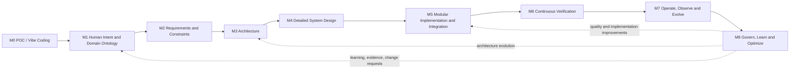

# MTS Worksheet Generation End-to-End Progress Tracker

Status: Active
Version: 2.0
Last updated: 2026-09-03

## Version History

| Version | Date | Change | Short description |
|---|---|---|---|
| 1.0 | 2026-08-28 | Rationalized reusable tracker created | Established the M0-M8 lifecycle checklist, initiative intake, evidence model, USSV check, impact assessment, and MTS worked example. |
| 2.0 | 2026-09-03 | Canonical progress tracker architecture update | Made this file the active `end-to-end-progress.md`, aligned terminology with effective config and loader/writer naming, and carried forward current operational run evidence from the prior active tracker. |

## Authority and Purpose

This tracker applies the AI-Native SDLC M0-M8 lifecycle to a new product, new feature, enhancement, or maintenance change. The canonical milestone meanings come from [AI-Native SDLC - Personal](../../../docs/knowledge/ai-native-sdlc-personal.md).

This tracker is a proactive control document. It records what must be understood, decided, built, verified, operated, and learned before work is considered complete. It complements an implementation plan, which should contain detailed engineering tasks.

The tracker has three layers:

1. Reusable M0-M8 checklist
2. Initiative status and evidence record
3. Current MTS Weekly Math Worksheet record

Do not change the canonical meaning of M0-M8 to fit one product. Add product-specific activities beneath the canonical milestone.

## Initiative Intake

Complete this section before starting the lifecycle.

| Field | Value |
|---|---|
| Initiative name |  |
| Change type | `new product` / `new feature` / `enhancement` / `maintenance` |
| Product or system affected |  |
| Owner |  |
| Requester / sponsor |  |
| Requested date |  |
| Target release or run |  |
| Scope |  |
| Exclusions |  |
| Existing behavior to preserve |  |
| Current milestone |  |

### M0 Applicability Decision

M0 is an uncertainty-reduction milestone. It is required when the work contains meaningful product, technical, domain, operational, or integration uncertainty.

- [ ] M0 POC/experiment is required.
- [ ] M0 is not required for this change.
- [ ] The rationale for skipping M0 is recorded below.

**M0 applicability rationale:**

> Replace this text with the decision and evidence. A small enhancement may skip a disposable POC when existing evidence demonstrates feasibility; it must still enter M1 or the affected downstream milestone.

## Status Vocabulary

Use these values in the initiative status table:

- `Not started`
- `In progress`
- `Blocked`
- `Ready for review`
- `Approved`
- `Complete`
- `Deferred`
- `Not applicable`

A milestone is `Complete` only when its exit evidence is present and its decision is recorded.

## Canonical Lifecycle



The lifecycle is iterative. A learning or production finding may reopen an earlier milestone. Do not force every change through all milestones when the evidence-based impact assessment shows that a subset is sufficient; record the skipped milestones and rationale.

## Reusable M0-M8 Checklist

### M0 - POC / Vibe Coding

**Purpose:** Learn quickly before committing to architecture or production implementation.

- [ ] Identify the key unknowns and risks.
- [ ] Define the smallest useful experiment or disposable prototype.
- [ ] Test technical feasibility, domain assumptions, integration access, or user value as applicable.
- [ ] Record what was learned and what remains unknown.
- [ ] Keep POC code separate from production code.
- [ ] Transfer useful learning into intent, requirements, knowledge, architecture, or an ADR.
- [ ] Decide whether to proceed, revise scope, defer, or stop.

**Exit evidence:** POC results, uncertainty decision, and captured learning. If not applicable, record the M0 rationale.

**Required artifact set:** POC/experiment record, feasibility evidence, uncertainty log, decision record, and captured learning routed to the next applicable milestone.

### M1 - Human Intent and Domain Ontology Preservation

**Purpose:** Preserve what humans mean before implementation choices distort it.

- [ ] Capture the problem, purpose, users, desired outcome, and success signals.
- [ ] Identify stakeholders, owner, approvers, and affected users.
- [ ] Define or update domain vocabulary, functional areas, entities, and relationships.
- [ ] Record constraints, exclusions, assumptions, and behavior to preserve.
- [ ] For an enhancement, link the existing product intent and record only the changed intent.
- [ ] Identify affected workflows, products, integrations, and data.
- [ ] Check that the intent can be explained simply and that important gaps are visible.

**Exit evidence:** Reviewed intent/domain artifact with scope, vocabulary, relationships, owner, and decision record.

**Required artifact set:** Product idea/intent brief, domain ontology, Functional Area candidates, Core Entity Model, stakeholder/context notes, scope/exclusions, and intent decision record.

### M2 - Requirements and Constraints

**Purpose:** State what the solution must do and how well it must work.

- [ ] Define functional requirements.
- [ ] Define NFRs and measurable quality attributes.
- [ ] Define scenarios, acceptance criteria, and failure behavior.
- [ ] Define privacy, security, compliance, accessibility, operational, and technology constraints as applicable.
- [ ] Define human approval gates and accountability.
- [ ] Identify backward-compatibility and migration requirements.
- [ ] Map each critical requirement to a test, fitness function, or manual evidence.
- [ ] Expose ambiguity and unresolved requirements before design begins.

**Exit evidence:** Approved requirements, constraints, acceptance criteria, risks, and traceability.

**Required artifact set:** Requirements document, Functional Area catalog, requirements hierarchy or one-page requirements view, functional requirements, NFRs, scenarios/use cases, acceptance criteria, constraints, risks/open decisions, and requirements-to-test/fitness-function traceability.

### M3 - Architecture

**Purpose:** Strategize and make consequential structural choices before detailed design.

- [ ] Define functional architecture: capabilities, components, boundaries, and interactions.
- [ ] Define informational architecture: entities, relationships, data flows, and ownership.
- [ ] Define non-functional architecture: quality strategies and fitness functions.
- [ ] Define technology architecture: alternatives, evaluation criteria, selected stack, and deviations.
- [ ] Define responsibility architecture: who does what and where it lives across Human, AI, Software, Knowledge, Config, Command, Workflow, Skill, and Code.
- [ ] Record integrations, dependencies, trade-offs, rejected alternatives, and ADRs.
- [ ] Define extensibility, compatibility, migration, rollback, and operational boundaries.
- [ ] Check that the architecture is explainable through a concise visual and structured source.

**Exit evidence:** Reviewed architecture with C1/C2 views, information model, NFR strategies, responsibility allocation, decisions, and risks.

**Required artifact set:**

- [ ] Functional Architecture, including capabilities, components, boundaries, and interactions.
- [ ] Informational Architecture, including domain entities, relationships, ownership, and data flows.
- [ ] Non-Functional Architecture, including quality attributes, strategies, measurable thresholds, and fitness functions.
- [ ] Technology Architecture, including alternatives, evaluation criteria, selected technologies, and deviations.
- [ ] Responsibility Architecture, including Human/AI/Software and Knowledge/Config/Command/Workflow/Skill/Code placement.
- [ ] C1 System Context Diagram.
- [ ] C2 Container Diagram.
- [ ] High-Level ERD.
- [ ] Architecture decisions/ADRs, trade-offs, dependencies, rejected alternatives, and risk register.

### M4 - Detailed System Design

**Purpose:** Turn architecture into implementable contracts and behavior.

- [ ] Define components, interfaces, APIs, schemas, data classes, and contracts.
- [ ] Define workflows, states, state transitions, algorithms, and invalidation/revision behavior.
- [ ] Define configuration ownership and source-of-truth locations.
- [ ] Define test strategy, fixtures, evals, fitness functions, and manual review evidence.
- [ ] Define migration, rollback, retry, recovery, observability, and support procedures.
- [ ] Define content, visual, accessibility, security, performance, and reliability validation as applicable.
- [ ] Confirm the design can be implemented in bounded increments.
- [ ] Check the design against requirements and architecture traceability.

**Exit evidence:** Approved detailed design, contracts/schemas, validation plan, release boundary, and unresolved-risk disposition.

**Required artifact set:**

- [ ] C3 Component Diagram.
- [ ] C4 implementation/deployment or code-level mapping.
- [ ] Detailed/Low-Level ERD.
- [ ] Component, data, interface, API, and integration contracts.
- [ ] Schemas and validation rules.
- [ ] Workflow, state machine, legal transitions, checkpoints, and invalidation/revision rules.
- [ ] Algorithms, pseudocode, and deterministic/probabilistic responsibility boundaries.
- [ ] Configuration ownership and source-of-truth map.
- [ ] Test plan, fixtures, eval plan, fitness-function definitions, and manual review plan.
- [ ] Migration, rollback, retry, recovery, security, accessibility, performance, and observability design where applicable.

### M5 - Iterative Modular Implementation and Integration

**Purpose:** Build and integrate working bounded components continuously.

- [ ] Create an implementation plan linked to M1-M4 artifacts.
- [ ] Build the smallest useful vertical slice or bounded module.
- [ ] Keep deterministic behavior in code and variable behavior in configuration.
- [ ] Keep stable facts in knowledge and AI reasoning in appropriate skills/workflows.
- [ ] Add or update schemas, configuration, commands, workflows, and code in their correct locations.
- [ ] Preserve existing behavior through regression tests.
- [ ] Validate success, failure, invalidation, resume, migration, and rollback paths.
- [ ] Integrate one boundary at a time with focused validation after each slice.
- [ ] Record implementation decisions, deviations, and known limitations.

**Exit evidence:** Working integrated slice, focused validation results, updated implementation plan, and no unresolved blocker for the release boundary.

**Required artifact set:** Implementation plan/task tracker, linked code/config/workflow/skill changes, migration records, updated contracts/schemas, decision/exception records, integration checkpoint evidence, and rollback-ready change set.

### M6 - Continuously Verified Development

**Purpose:** Prove the implementation and its quality continuously rather than only at the end.

- [ ] Run unit, integration, regression, browser, contract, or domain tests as applicable.
- [ ] Run AI evaluations for AI-generated or AI-assisted behavior as applicable.
- [ ] Run architecture fitness functions for critical NFRs.
- [ ] Verify correctness, synchronization, failure behavior, security, accessibility, performance, and observability.
- [ ] Independently verify generated content; successful generation is not proof of correctness.
- [ ] Validate documentation, configuration, schemas, and migration artifacts.
- [ ] Record failures, corrections, reruns, and final evidence.
- [ ] Confirm the implementation is ready for staging or controlled operation.

**Exit evidence:** Passing verification record, regression evidence, fitness-function results, resolved defects, and explicit readiness decision.

**Required artifact set:** Unit/integration/contract/browser tests as applicable, regression suite, AI evaluations, architecture fitness-function results, security/accessibility/performance checks, defect/correction log, verification summary, and release-readiness decision.

### M7 - Operate, Observe and Evolve

**Purpose:** Learn from staging or production behavior and feed evidence into product evolution.

- [ ] Execute a controlled staging, pilot, or production run.
- [ ] Verify environment prerequisites, permissions, credentials, dependencies, and configuration.
- [ ] Capture runtime state, outputs, approvals, telemetry, metrics, feedback, and incidents.
- [ ] Verify the real workflow, not only mocked behavior, where feasible.
- [ ] Compare observed behavior with acceptance criteria and expected quality.
- [ ] Record defects, support issues, user feedback, performance, cost, and operational friction.
- [ ] Decide whether to continue, correct, roll back, expand, or reopen an earlier milestone.
- [ ] Create prioritized improvement items with owners and evidence.

**Exit evidence:** Operational/staging report, runtime evidence, feedback record, disposition of issues, and evolution decision.

**Required artifact set:** Run manifest, effective config snapshot, input/output artifacts, approvals, telemetry, logs/metrics, staging or production QA, user feedback, incidents, support notes, and operational decision record.

### M8 - Govern, Learn and Optimize

**Purpose:** Use accumulated evidence to improve the product, architecture, governance, knowledge, and methodology.

- [ ] Review whether the delivered change preserved human intent and approved scope.
- [ ] Review compliance, security, reliability, accessibility, support, and operational outcomes.
- [ ] Capture reusable knowledge, examples, decisions, and failure learnings.
- [ ] Review architecture and responsibility allocation against observed evidence.
- [ ] Review quality, delivery speed, cost, token/tool use, and reviewability.
- [ ] Identify configuration, workflow, skill, code, test, or documentation improvements.
- [ ] Update backlog, roadmap, ADRs, requirements, architecture, or methodology when evidence warrants it.
- [ ] Decide whether the initiative is complete, continuing, deferred, or reopening an earlier milestone.

**Exit evidence:** Governance/learning review, captured improvements, updated knowledge or decisions, and next-cycle disposition.

**Required artifact set:** Governance review, lessons-learned record, updated knowledge/examples, ADR or architecture updates, backlog/roadmap changes, methodology/process improvements, cost/token/tool analysis, and next-cycle decision.

## Artifact Inventory by Milestone

This inventory is the compact answer to “what must exist before we move on?” It expands the checklist above without changing milestone ownership.

| Milestone | Recommended Artifacts | Artifact Key Sections | Purpose |
|---|---|---|---|
| **M0 - POC / Vibe Coding** | 1. **POC Brief**<br>2. **Experiment Plan**<br>3. **Feasibility Report**<br>4. **Uncertainty Log**<br>5. **POC Decision Record**<br>6. **Learning Capture** | 1. Hypothesis, unknowns, scope, success signal<br>2. Experiment design, inputs, steps, stop conditions<br>3. Results, evidence, limitations, recommendation<br>4. Risk/unknown, impact, evidence, owner, disposition<br>5. Proceed, revise, defer, or stop decision<br>6. Learning transferred to M1-M5 or ADR | Reduce uncertainty before committing to production architecture or implementation. No separate M0 file exists for the current MTS initiative; record the M0 decision as `Not applicable` when justified. |
| **M1 - Human Intent and Domain Ontology Preservation** | 1. **Product Idea** - [product_idea.md](../01.%20intent/product_idea.md)<br>2. **Intent Brief**<br>3. **Domain Ontology** - [ontology.md](../../../ontology.md)<br>4. **Functional Area Catalog**<br>5. **Core Entity Model**<br>6. **Stakeholder Map**<br>7. **Scope and Exclusions Record**<br>8. **Intent Decision Record** | 1. Problem, users, outcome, scope, quality intent<br>2. Request summary, goals, constraints, success signals<br>3. Terms, concepts, entities, relationships<br>4. Functional Area code, definition, ownership, affected artifacts<br>5. Entity definitions, relationships, lifecycle<br>6. Stakeholders, roles, approvers, accountability<br>7. Included behavior, exclusions, assumptions<br>8. Approval, unresolved intent, preservation decisions | Preserve human meaning and establish the vocabulary and domain model used by all later artifacts. |
| **M2 - Requirements and Constraints** | 1. **Requirements Document** - [requirements.md](../01.%20intent/requirements.md)<br>2. **Functional Requirements Catalog**<br>3. **NFR Catalog**<br>4. **Requirements Hierarchy**<br>5. **Scenario/Use-Case Catalog**<br>6. **Acceptance Criteria**<br>7. **Constraints and Risks Record**<br>8. **Requirements Traceability Matrix** | 1. Purpose, precedence, functional areas, requirements, constraints<br>2. Requirement ID, statement, rationale, owner<br>3. Quality attribute, threshold, risk, evidence method<br>4. Product -> capability -> requirement structure<br>5. Actor, trigger, flow, alternate flow, failure behavior<br>6. Given/when/then or measurable completion condition<br>7. Constraint, assumption, risk, open decision, disposition<br>8. Intent -> requirement -> design -> implementation -> test/evidence | State what must be built, how well it must work, what is constrained, and how success will be proven. |
| **M3 - Architecture** | 1. **Architecture Document** - [architecture.md](../02.%20architecture/architecture.md)<br>2. **C1 System Context Diagram**<br>3. **C2 Container Diagram**<br>4. **High-Level ERD**<br>5. **Functional Architecture**<br>6. **Informational Architecture**<br>7. **Non-Functional Architecture**<br>8. **Technology Architecture**<br>9. **Responsibility Architecture**<br>10. **Architecture Decision Records (ADRs)**<br>11. **Architecture Risk and Trade-off Register** | 1. Authority, scope, architecture views, decisions<br>2. Users, systems, external actors, trust boundaries<br>3. Containers, responsibilities, interactions, data movement<br>4. Major entities, ownership, relationships, cardinality<br>5. Capabilities, components, system boundaries<br>6. Information concepts, data flows, ownership<br>7. Quality attributes, strategies, fitness functions<br>8. Alternatives, criteria, selected technology, deviations<br>9. Human/AI/Software and Knowledge/Config/Command/Workflow/Skill/Code placement<br>10. Context, decision, options, consequences, status<br>11. Risk, impact, option comparison, mitigation, owner | Make consequential structural choices before detailed design, including boundaries, data, quality, technology, responsibilities, and trade-offs. |
| **M4 - Detailed System Design** | 1. **Detailed Design Document** - [design.md](../03.%20design/design.md)<br>2. **C3 Component Diagram**<br>3. **C4 Implementation/Code-Level Mapping**<br>4. **Detailed/Low-Level ERD**<br>5. **API and Interface Contracts**<br>6. **Data Contracts and Schema Definitions** - [schemas](../../../schemas/)<br>7. **Workflow Definition** - [workflow](../../../workflows/generate-weekly-worksheets.md)<br>8. **State Machine**<br>9. **Revision and Invalidation Contract**<br>10. **Algorithm/Pseudocode Notes**<br>11. **Configuration Ownership Map**<br>12. **Detailed Test Plan**<br>13. **Migration/Rollback Plan**<br>14. **Observability Plan** | 1. Purpose, state, components, interfaces, contracts, test design<br>2. Components, dependencies, provided/required interfaces<br>3. Component-to-module/file/config mapping<br>4. Tables/entities, attributes, keys, relationships, constraints<br>5. Inputs, outputs, errors, retries, versioning<br>6. Fields, types, validation, compatibility, lineage<br>7. Sequence, gates, actors, inputs, outputs, failure paths<br>8. States, legal transitions, entry/exit conditions<br>9. Changed input, invalidated evidence, preserved evidence<br>10. Deterministic logic, pseudocode, edge cases<br>11. Setting owner, source of truth, precedence, override rules<br>12. Unit, integration, regression, eval, manual, fitness-function checks<br>13. Migration steps, rollback trigger, recovery procedure<br>14. Metrics, logs, traces, alerts, retention, diagnostic fields | Turn architecture into implementable, testable, recoverable, and operationally explicit design. |
| **M5 - Iterative Modular Implementation and Integration** | 1. **Implementation Plan and Task Tracker** - [plan-and-tasks.md](plan-and-tasks.md)<br>2. **Vertical Slice Record**<br>3. **Code Change Set** - target [src/mts](../../../src/), with legacy [src/runtime](../../../src/runtime/) and [src/rendering](../../../src/rendering/) retained until migration validation<br>4. **Configuration/Data Change Set** - target `data/config`, `data/master`, and `data/transactions`, with legacy [config](../../../config/) retained until migration validation<br>5. **Workflow/Skill/Command Change Set**<br>6. **Migration Record**<br>7. **Integration Checkpoint Record**<br>8. **Implementation Decision/Deviation Log**<br>9. **Rollback Record** | 1. Module, tasks, dependencies, entry/exit checks<br>2. Scope, affected contracts, implementation, focused validation<br>3. Changed modules, behavior, tests, review status<br>4. Defaults, flags, precedence, migration impact<br>5. Sequence, AI reasoning contract, invocation behavior<br>6. Before/after state, data changes, compatibility<br>7. Integrated boundaries, command, result, evidence<br>8. Decision, reason, alternatives, affected artifacts<br>9. Trigger, rollback steps, restored state, verification | Build bounded increments, integrate them safely, preserve traceability, and maintain rollback capability. |
| **M6 - Continuously Verified Development** | 1. **Unit Test Report**<br>2. **Integration Test Report**<br>3. **Contract Test Report**<br>4. **Regression Test Report**<br>5. **Browser Test Report**<br>6. **AI Evaluation Report**<br>7. **Architecture Fitness Function Report**<br>8. **Security Review**<br>9. **Accessibility Review**<br>10. **Performance Review**<br>11. **Defect and Correction Log**<br>12. **Verification Summary**<br>13. **Readiness Decision Record** | 1-5. Scope, command, fixtures, results, failures, reruns<br>6. Prompt/task, dataset, rubric, results, limitations<br>7. NFR, strategy, executable check, threshold, evidence<br>8. Threats, controls, findings, remediation<br>9. Standards, findings, remediation, retest<br>10. Workload, measurements, threshold, environment<br>11. Defect, severity, root cause, correction, regression check<br>12. Coverage, passed/failed/ambiguous, residual risk<br>13. Evidence reviewed, decision, conditions, owner | Provide independent evidence that the implementation and critical quality attributes work as required. |
| **M7 - Operate, Observe and Evolve** | 1. **Run Manifest**<br>2. **Effective Config Snapshot**<br>3. **Input/Output Artifact Register**<br>4. **Approval Record**<br>5. **Operational QA Report**<br>6. **Visual/Layout QA Report**<br>7. **Telemetry Record**<br>8. **Metrics Summary**<br>9. **Feedback Record**<br>10. **Incident/Support Record**<br>11. **Operational Decision Record**<br>12. **Improvement Backlog** | 1. Run ID, inputs, stages, gates, revisions, artifacts, status<br>2. Effective defaults, overrides, sources, fingerprint<br>3. Artifact ID, source, revision, link, status, correspondence<br>4. Gate, reviewer, decision, timestamp, artifact revision<br>5. Content, completeness, permissions, operational checks<br>6. Pagination, whitespace, wrapping, readability, visual findings<br>7. Timing, tools, retries, cache, token usage when authoritative<br>8. Baseline, observed value, threshold, trend<br>9. User, feedback, context, severity, action<br>10. Incident/support issue, impact, response, resolution<br>11. Continue, correct, roll back, expand, or reopen milestone<br>12. Improvement, rationale, priority, owner, evidence | Capture real staging or production behavior and feed observed evidence into product evolution. |
| **M8 - Govern, Learn and Optimize** | 1. **Governance Review**<br>2. **Lessons-Learned Record**<br>3. **Knowledge Update**<br>4. **Example/Pattern Update**<br>5. **ADR Update**<br>6. **Architecture Evolution Record**<br>7. **Requirements/Process Change Record**<br>8. **Cost and Token Analysis**<br>9. **Methodology Improvement Record**<br>10. **Roadmap/Backlog Update**<br>11. **Next-Cycle Decision Record** | 1. Scope, compliance, approvals, residual risk, governance decision<br>2. What worked, failed, root causes, reusable learning<br>3. Facts, sources, freshness, owner, affected workflows<br>4. Reusable example, context, constraints, verification<br>5. Changed decision, evidence, consequences, supersession<br>6. Trigger, affected views, migration, decision<br>7. Changed requirement/process, rationale, traceability<br>8. Time, tools, tokens, cost, quality trade-offs<br>9. Method change, expected benefit, evidence plan<br>10. Improvement items, priorities, owners, dependencies<br>11. Complete, continue, defer, or reopen milestone | Convert operational evidence into durable governance, knowledge, architecture, product, and methodology improvements. |

### Artifact Naming Rules

- Use one stable artifact name per responsibility; do not create multiple competing “source of truth” documents for the same purpose.
- Add the initiative or feature identifier and revision/date where the artifact is versioned, for example `requirements-feature-x-v1.md` or `run-manifest-2026-08-24.json`.
- Keep visual artifacts traceable to their concise structured source, for example `c1-system-context.mmd` derived from the architecture document.
- Keep evidence artifacts close to the implementation or run they prove, while linking them from this tracker.
- Mark an artifact `Not applicable` with a rationale instead of deleting it from the checklist.

## Artifact Review Pattern

For every consequential artifact, use the methodology's preferred review sequence:

```text
Visual / one-page summary -> concise structured source -> detail on demand
```

Apply this pattern explicitly where it improves reviewability:

- [ ] Product/intent summary before detailed intent and ontology.
- [ ] Requirements hierarchy or Functional Area map before detailed requirements.
- [ ] C1/C2 architecture summary before detailed architecture prose.
- [ ] High-level ERD before detailed data model.
- [ ] C3/C4 design summary before detailed contracts and implementation mapping.
- [ ] State/workflow diagram before transition and invalidation detail.
- [ ] Verification/QA summary before per-test or per-item evidence.
- [ ] Runtime/release summary before logs and raw telemetry.

Every visual must be traceable to its structured source. A diagram is not complete evidence by itself.

## Initiative Status and Evidence

| Milestone | Status | Applicable? | Owner | Evidence | Approval/decision | Blocker or next action | Updated |
|---|---|---|---|---|---|---|---|
| M0 | Not started |  |  |  |  |  |  |
| M1 | Not started |  |  |  |  |  |  |
| M2 | Not started |  |  |  |  |  |  |
| M3 | Not started |  |  |  |  |  |  |
| M4 | Not started |  |  |  |  |  |  |
| M5 | Not started |  |  |  |  |  |  |
| M6 | Not started |  |  |  |  |  |  |
| M7 | Not started |  |  |  |  |  |  |
| M8 | Not started |  |  |  |  |  |  |

## Recursive USSV Check

The AI-Native SDLC uses Understand -> Strategize -> Solve -> Verify recursively within significant milestones. Complete this mini-check for any substantial slice, decision, incident, or enhancement.

| USSV stage | Question | Evidence |
|---|---|---|
| Understand | What problem, facts, users, constraints, and uncertainty are present? |  |
| Strategize | What options, trade-offs, boundaries, and decision criteria apply? |  |
| Solve | What bounded design, implementation, or operational action was taken? |  |
| Verify | What independent evidence proves the result and exposes remaining gaps? |  |

## Change Impact Assessment

Complete this for enhancements and changes to an existing product.

- [ ] Existing intent affected
- [ ] Requirements affected
- [ ] Architecture affected
- [ ] Detailed design affected
- [ ] Configuration affected
- [ ] Knowledge/source data affected
- [ ] Workflow/skill/command affected
- [ ] Code affected
- [ ] Tests/evals affected
- [ ] Runtime data or migration affected
- [ ] User documentation affected
- [ ] Operational/support process affected

**Impact summary:**

**Milestones reopened:**

**Compatibility and rollback decision:**

## Current MTS Weekly Math Worksheet Record

This record shows the current MTS Weekly Math Worksheet initiative status. It does not redefine the canonical M0-M8 lifecycle above.

| Milestone | Example status | Example evidence / interpretation |
|---|---|---|
| M0 | Not applicable / recorded | Existing MTS workflow and feasibility evidence were already available; no new disposable POC was required for this weekly run. |
| M1 | Complete | Product Idea and ontology preserve the worksheet-generation intent, vocabulary, entities, and functional areas. |
| M2 | Complete | Requirements define worksheet behavior, NFRs, acceptance criteria, human gates, and publication constraints. |
| M3 | Complete | Architecture defines shared core, Math module, Google Docs/Drive boundaries, data ownership, and responsibility allocation. |
| M4 | Complete | Detailed design defines schemas, state machine, gates, invalidation, Spec persistence, rendering, QA, and publication contracts. |
| M5 | Complete | Runtime, Math adapter, Spec persistence, gate controller, and rendering integration were implemented in bounded slices. |
| M6 | Complete for staging evidence | Regression tests, weekly lifecycle tests, live read-back QA, PDF export, duplicate-template correction, and layout signal checks passed. |
| M7 | In progress | Current weekly run is rendered in Drive staging and automated QA passes. Human Gate 4 formatting review is pending; Gate 5 and canonical publication have not occurred. |
| M8 | Not complete | Governance, learning capture, final approval disposition, and optimization review remain after the run is resolved. |

### Current M7 Operational Run Checkpoint

Run: `run-2026-08-24-weekly`

Instructional week: `2026-08-24` through `2026-08-28`

Worksheet Type: Weekly Worksheet

Curriculum confidence: `inferred`; weekly pacing is not represented as confirmed CCS pacing.

| Run step | Evidence | Status |
|---|---|---|
| Original request and run context | Run directory and materialization records | Complete |
| Curriculum scope resolution | Weekly cache and Gate 1 review record | Complete |
| Gate 1: Curriculum Scope Review | Approval recorded in run evidence | Complete |
| Worksheet plan preparation | Five plans; Grade 9/10 resolved independently | Complete |
| Question generation and Gate 2 review | Approved question review record and five Specs | Complete |
| Spec materialization | `runs/math/run-2026-08-24-weekly/specs/*.json` | Complete |
| Independent verification | Grade 1 and Grade 6 runtime verification; remaining item evidence needs reconciliation in the manifest | Needs reconciliation |
| Template resolution | Worksheet revision `3`; answer-key revision `2` | Complete |
| Google Docs rendering | Ten copied editable Docs in `outputs-copilot` staging | Complete |
| Read-back content QA | Counts, numbering, pair correspondence, and placeholder checks | Complete |
| PDF/layout signal QA | Ten PDFs; no blank pages; counts 50/50/50/40/50 | Complete |
| Gate 4: Formatting Review | Human visual review of staged Docs | Pending |
| Final QA | Names, dates, labels, page layout, editability, and pair integrity | Pending Gate 4 |
| Gate 5: Publish Approval | Explicit approval before canonical publication | Pending |
| Canonical publication | `outputs/math/` / configured final Drive destination | Not started |

### Current Run Artifacts

These are legacy current-run paths retained until the `data/transactions` migration is implemented and validated.

- Run status: `gate_4_formatting_review_pending`
- Run manifest: `runs/math/run-2026-08-24-weekly/materialization-manifest.json`
- Spec index: `runs/math/run-2026-08-24-weekly/worksheet-specs.json`
- Render record: `runs/math/run-2026-08-24-weekly/rendered-artifacts.json`
- Local PDF QA evidence: `runs/math/run-2026-08-24-weekly/qa-pdfs/`
- Staging destination: configured `outputs-copilot` Drive folder
- Canonical publication: prohibited until Gate 5 approval

### Current Run Evidence

- Product Idea: `specs/generate_math_worksheets/01. intent/product_idea.md`
- Requirements: `specs/generate_math_worksheets/01. intent/requirements.md`
- Architecture: `specs/generate_math_worksheets/02. architecture/architecture.md`
- Detailed design: `specs/generate_math_worksheets/03. design/design.md`
- Implementation plan: `specs/generate_math_worksheets/04. implementation/plan-and-tasks.md`
- Current run tracker: `runs/math/run-2026-08-24-weekly/materialization-manifest.json`
- Worksheet Specs: `runs/math/run-2026-08-24-weekly/specs/`
- Rendered artifacts: `runs/math/run-2026-08-24-weekly/rendered-artifacts.json`
- PDF/layout QA: `runs/math/run-2026-08-24-weekly/qa-pdfs/`

## Update Rules

1. Keep this tracker aligned with the canonical AI-Native SDLC milestone names and meanings.
2. Use the implementation plan for detailed coding tasks; use this tracker for lifecycle readiness, decisions, and evidence.
3. Record applicability decisions explicitly, including why a milestone was skipped.
4. Keep human accountability and approvals distinct from AI reasoning and deterministic software evidence.
5. Do not claim verification from generation success; record independent tests, evaluations, or manual evidence.
6. Keep run artifacts under the legacy run directory until migration, then under `data/transactions`; link them here rather than copying them into the tracker.
7. Reopen affected milestones when intent, requirements, architecture, design, implementation, or runtime evidence changes.
8. Use M7 for operation and observed runtime behavior; use M8 for governance, learning, optimization, and the next-cycle decision.
9. Prefer the review pattern: visual summary -> concise structured source -> detail on demand.
10. Keep diagrams reconstructable from the structured status and evidence fields.

## Change Log

| Date | Change | Result |
|---|---|---|
| 2026-08-28 | Created rationalized reusable M0-M8 tracker aligned to AI-Native SDLC Personal v2.2. | Canonical milestone meanings, reusable checklists, applicability, USSV recursion, evidence, and learning loop are explicit. |
| 2026-09-03 | Promoted rationalized tracker to canonical active tracker. | Added version history, carried forward current operational run evidence, and aligned wording with effective config plus target `src/mts` and `data/` architecture. |
